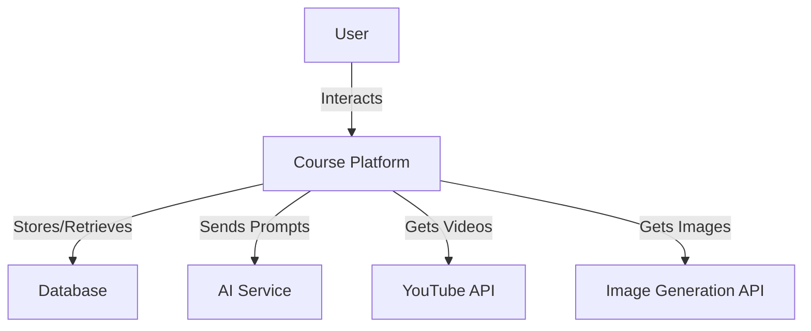
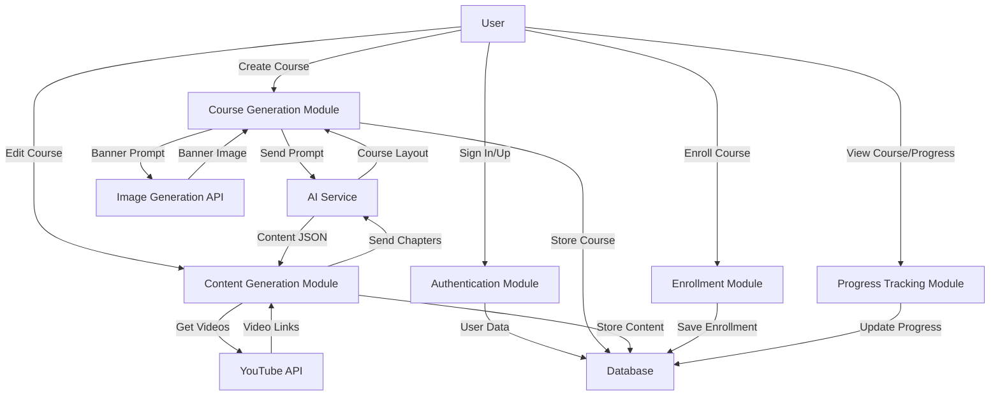
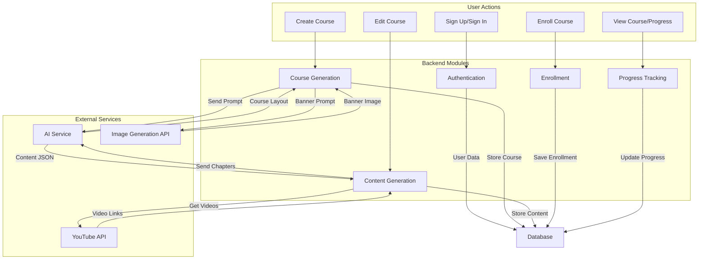
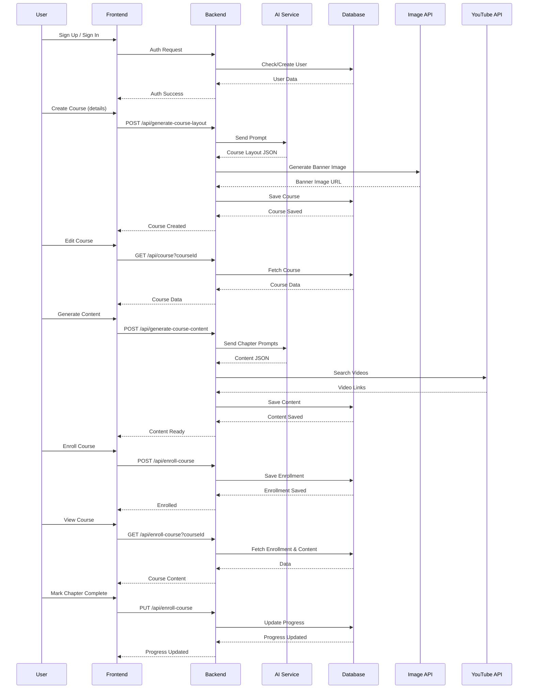
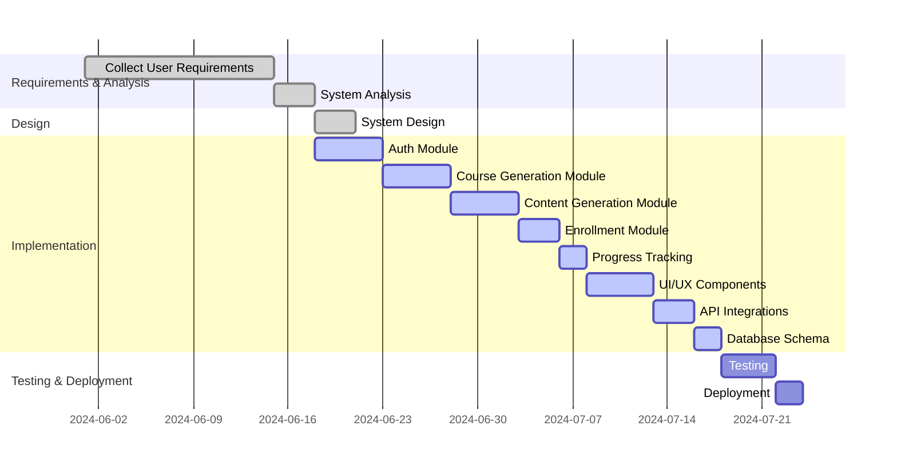

# Project Diagrams

## DFD-0 (System Context)



## DFD-1 (Major Modules)



## DFD-2 (Detailed Data Flows)



## Use Case Diagram

```mermaid
%% UML Use Case Diagram with stickman actor
usecaseDiagram
  actor User as "User"
  User --> (Sign In/Up)
  User --> (Create Course (AI))
  User --> (Edit Course)
  User --> (Generate Course Content (AI))
  User --> (Enroll in Course)
  User --> (View Course)
  User --> (Track Progress)

  (Sign In/Up) --> (Dashboard / Workspace)
  (Dashboard / Workspace) --> (Create Course (AI))
  (Dashboard / Workspace) --> (Edit Course)
  (Dashboard / Workspace) --> (Enroll in Course)
  (Dashboard / Workspace) --> (View Course)

  (Create Course (AI)) --> (Generate Course Content (AI))
  (Create Course (AI)) --> (Banner Image Generation)
  (Generate Course Content (AI)) --> (Get Videos)
  (Generate Course Content (AI)) --> (Save Content)
  (Enroll in Course) --> (Save Enrollment)
  (View Course) --> (Track Progress)
```

## Sequence Diagram



## Gantt Chart


