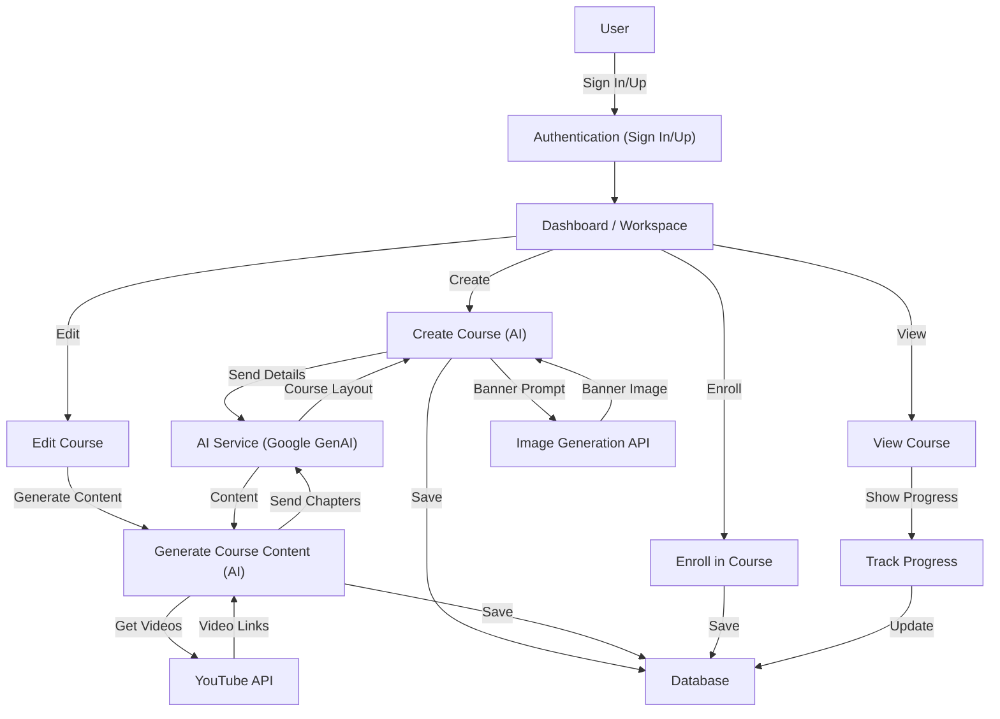
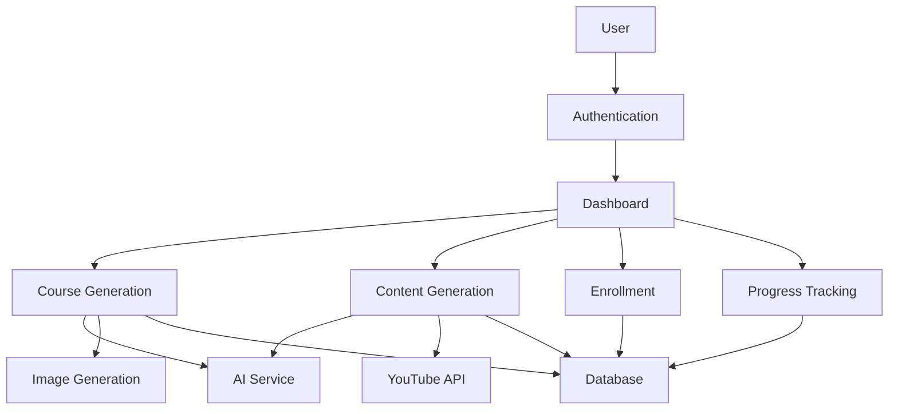
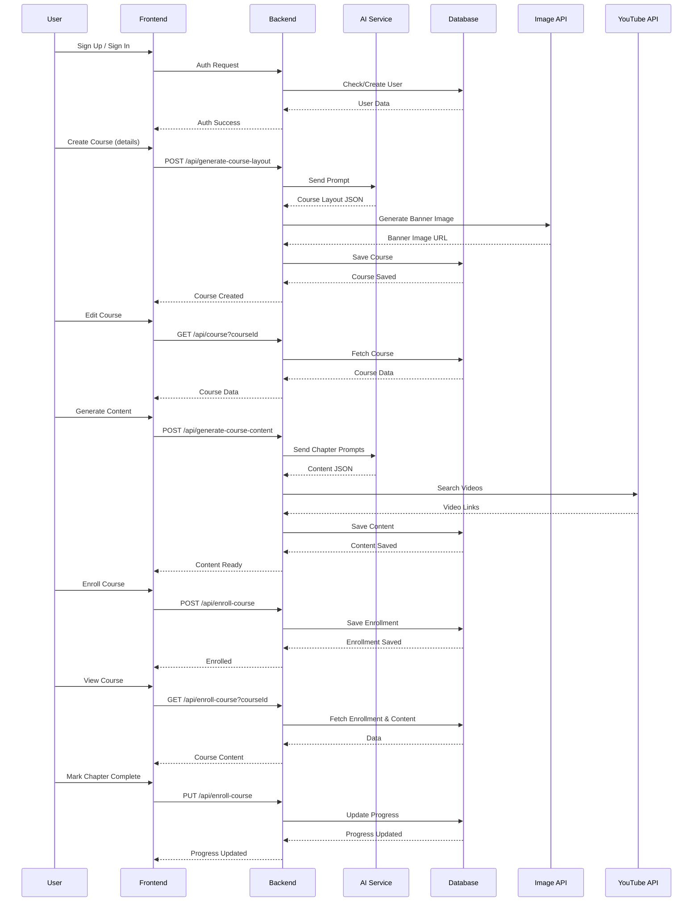
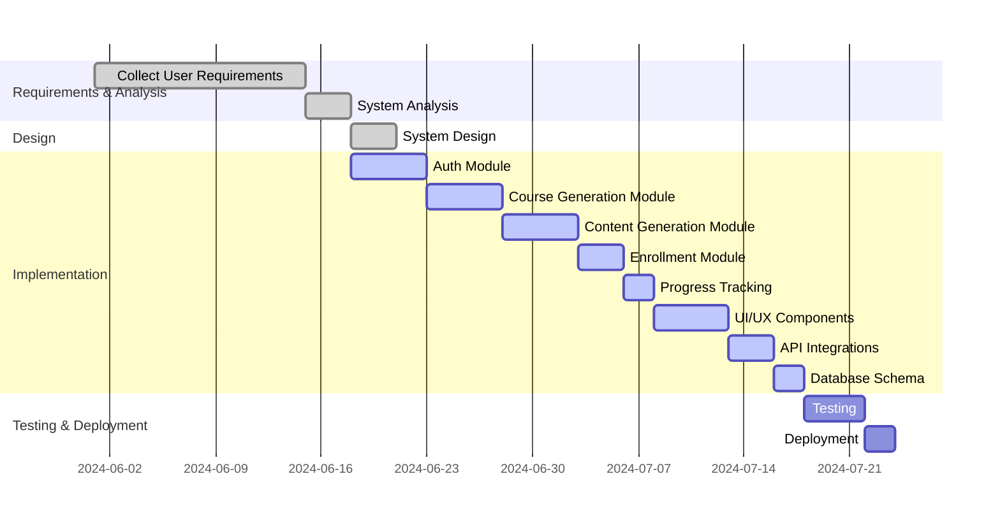

# Project Diagrams

## Use Case Diagram

```mermaid
graph TD;
  User["User"]
  Auth["Authentication (Sign In/Up)"]
  Dashboard["Dashboard / Workspace"]
  CourseCreation["Create Course (AI)"]
  CourseEdit["Edit Course"]
  CourseContentGen["Generate Course Content (AI)"]
  Enroll["Enroll in Course"]
  ViewCourse["View Course"]
  Progress["Track Progress"]
  DB["Database"]
  AI["AI Service (Google GenAI)"]
  ImageGen["Image Generation API"]
  YouTube["YouTube API"]

  User -->|Sign In/Up| Auth
  Auth --> Dashboard
  Dashboard -->|Create| CourseCreation
  CourseCreation -->|Send Details| AI
  AI -->|Course Layout| CourseCreation
  CourseCreation -->|Save| DB
  Dashboard -->|Edit| CourseEdit
  CourseEdit -->|Generate Content| CourseContentGen
  CourseContentGen -->|Send Chapters| AI
  AI -->|Content| CourseContentGen
  CourseContentGen -->|Get Videos| YouTube
  YouTube -->|Video Links| CourseContentGen
  CourseContentGen -->|Save| DB
  Dashboard -->|Enroll| Enroll
  Enroll -->|Save| DB
  Dashboard -->|View| ViewCourse
  ViewCourse -->|Show Progress| Progress
  Progress -->|Update| DB
  CourseCreation -->|Banner Prompt| ImageGen
  ImageGen -->|Banner Image| CourseCreation
```

## DFD-0/1/2 Diagram (System Context and Data Flows)

```mermaid
flowchart TD
  User["User"]
  Auth["Authentication"]
  Dashboard["Dashboard"]
  CourseGen["Course Generation"]
  ContentGen["Content Generation"]
  Enroll["Enrollment"]
  Progress["Progress Tracking"]
  DB["Database"]
  AI["AI Service"]
  ImgGen["Image Generation"]
  YT["YouTube API"]

  User --> Auth
  Auth --> Dashboard
  Dashboard --> CourseGen
  CourseGen --> AI
  CourseGen --> ImgGen
  CourseGen --> DB
  Dashboard --> ContentGen
  ContentGen --> AI
  ContentGen --> YT
  ContentGen --> DB
  Dashboard --> Enroll
  Enroll --> DB
  Dashboard --> Progress
  Progress --> DB
```

## Sequence Diagram

```mermaid
sequenceDiagram
  participant U as User
  participant FE as Frontend
  participant BE as Backend
  participant AI as AI Service
  participant DB as Database
  participant IMG as Image API
  participant YT as YouTube API

  U->>FE: Sign Up / Sign In
  FE->>BE: Auth Request
  BE->>DB: Check/Create User
  DB-->>BE: User Data
  BE-->>FE: Auth Success

  U->>FE: Create Course (details)
  FE->>BE: POST /api/generate-course-layout
  BE->>AI: Send Prompt
  AI-->>BE: Course Layout JSON
  BE->>IMG: Generate Banner Image
  IMG-->>BE: Banner Image URL
  BE->>DB: Save Course
  DB-->>BE: Course Saved
  BE-->>FE: Course Created

  U->>FE: Edit Course
  FE->>BE: GET /api/course?courseId
  BE->>DB: Fetch Course
  DB-->>BE: Course Data
  BE-->>FE: Course Data

  U->>FE: Generate Content
  FE->>BE: POST /api/generate-course-content
  BE->>AI: Send Chapter Prompts
  AI-->>BE: Content JSON
  BE->>YT: Search Videos
  YT-->>BE: Video Links
  BE->>DB: Save Content
  DB-->>BE: Content Saved
  BE-->>FE: Content Ready

  U->>FE: Enroll Course
  FE->>BE: POST /api/enroll-course
  BE->>DB: Save Enrollment
  DB-->>BE: Enrollment Saved
  BE-->>FE: Enrolled

  U->>FE: View Course
  FE->>BE: GET /api/enroll-course?courseId
  BE->>DB: Fetch Enrollment & Content
  DB-->>BE: Data
  BE-->>FE: Course Content

  U->>FE: Mark Chapter Complete
  FE->>BE: PUT /api/enroll-course
  BE->>DB: Update Progress
  DB-->>BE: Progress Updated
  BE-->>FE: Progress Updated
```

## Gantt Chart

```mermaid
gantt
dateFormat  YYYY-MM-DD
section Requirements & Analysis
Collect User Requirements      :done,    reqs, 2024-06-01, 14d
System Analysis                :done,    analysis, after reqs, 3d
section Design
System Design                  :done,    design, after analysis, 3d
section Implementation
Auth Module                    :active,  auth, 2024-06-18, 5d
Course Generation Module       :active,  coursegen, after auth, 5d
Content Generation Module      :active,  contentgen, after coursegen, 5d
Enrollment Module              :active,  enroll, after contentgen, 3d
Progress Tracking              :active,  progress, after enroll, 2d
UI/UX Components               :active,  uiux, after progress, 5d
API Integrations               :active,  apiint, after uiux, 3d
Database Schema                :active,  db, after apiint, 2d
section Testing & Deployment
Testing                        :         test, after db, 4d
Deployment                     :         deploy, after test, 2d
```
