# 🌐 BanglaRAG System

A comprehensive **Retrieval-Augmented Generation (RAG)** system that supports **mixed-language** (English & Bangla) text and **voice input** for chatting with PDF documents. This advanced system combines cutting-edge AI models with multilingual capabilities to create an intelligent knowledge base from your academic and professional documents.

> **🚀 Latest Update (August 6, 2025)**: Streamlined project structure with unified launcher (`main.py`), organized documentation in `Test Reports/`, and consolidated voice demonstrations. The system now features a clean, production-ready architecture with 30% fewer files in the root directory.

## 🚀 Performance Highlights

- **⚡ 83.2% Faster Response Times**: Optimized from 36.11s to 6.06s (5.96x faster)
- **🎯 High Success Rate**: 82.61% overall success rate with 90.91% for Bangla queries
- **🧠 Intelligent Model Caching**: Singleton pattern with preloading for instant responses
- **💾 Advanced Database Caching**: Persistent caching with 20-30% hit rates
- **🔄 Smart Translation Pipeline**: Skip unnecessary translations (0.1s for English queries)
- **📝 Optimized Prompts**: 74% reduction in token count (2,688 → 691 chars)
- **🎯 Production-Ready**: Fully integrated optimizations with robust error handling
- **📊 Consistent Performance**: Sub-7 second response times maintained across all tests
- **🔍 High Confidence**: 82.6% of responses marked as high confidence

## 📊 Performance Comparison (Actual Test Results)

### **🚀 Latest System (August 6, 2025)**

- **Average Response Time**: **6.06 seconds**
- **Tests**: 23 comprehensive mixed-language tests
- **Overall Success Rate**: **82.61%**
- **English Success Rate**: **75.0%** (9/12 tests)
- **Bangla Success Rate**: **90.91%** (10/11 tests)
- **Status**: **Production-Ready with Enhanced English Processing**

### **⚡ Previous Optimized System (July 15, 2025)**

- **Average Response Time**: **7.31 seconds**
- **Tests**: 23 comprehensive mixed-language tests
- **Status**: **Fully Optimized System**

### **📈 Pre-Optimization System (July 13, 2025)**

- **Average Response Time**: **36.11 seconds**
- **Tests**: 9 basic tests
- **Status**: **Pre-optimization System**

### **📈 Baseline System (July 8, 2025)**

- **Average Response Time**: **27.86 seconds**
- **Tests**: 9 basic tests
- **Status**: **Original System**

## 🏆 Performance Improvement Analysis

### **Latest vs Pre-Optimization (July 13 → August 6)**

- **Improvement**: 36.11s → 6.06s
- **Performance Gain**: **83.2% faster**
- **Speed Multiplier**: **5.96x faster**

### **Latest vs Previous Optimized (July 15 → August 6)**

- **Improvement**: 7.31s → 6.06s
- **Performance Gain**: **17.1% faster**
- **Additional Speed Improvement**: **1.21x faster**

### **Latest vs Baseline (July 8 → August 6)**

- **Improvement**: 27.86s → 6.06s
- **Performance Gain**: **78.2% faster**
- **Speed Multiplier**: **4.6x faster**

### **Most Significant Cumulative Improvement**

The total improvement from **July 13 → August 6**:

- **Before optimization**: 36.11 seconds
- **After all optimizations**: 6.06 seconds
- **Total Improvement**: **83.2% faster**
- **Overall Speed Multiplier**: **5.96x faster**

## 🎯 Key Performance Insights

1. **Consistency**: The optimized system maintains **sub-7 second** response times consistently
2. **Language Performance**: Bangla queries excel with **90.91% success rate** vs English **75.0%**
3. **Overall Reliability**: **82.61% overall success rate** with high confidence responses
4. **Continuous Improvement**: **17.1% additional speed boost** from July to August 2025
5. **Target Achievement**: Well below the **<10 second** target with room for English optimization
6. **Confidence Distribution**: **82.6% high confidence** responses across all tests

## 🌟 Features

### 📚 Core RAG Capabilities

- **📄 PDF Processing**: Automatically load and process PDF documents with metadata preservation
- **🔍 Intelligent Chunking**: Split documents with language-aware segmentation for English and Bangla
- **🧠 Mixed-Language Embeddings**: Use specialized models (BanglaBERT for Bangla, Nomic Embed for English)
- **💾 Persistent Storage**: Store embeddings in ChromaDB with comprehensive metadata
- **🤖 AI Chat Interface**: Interactive chat powered by Ollama LLMs with cross-language support

### 🎤 Voice Input Features

- **🎙️ Voice-to-Text**: Whisper-powered ASR supporting multiple languages
- **🔊 Interactive Voice Sessions**: Real-time voice query processing
- **📱 Hands-Free Operation**: Complete voice-driven interaction capabilities
- **🌐 Multilingual Voice Support**: Voice input in English and Bangla

### 🌍 Multilingual Support

- **🔤 Language Detection**: Automatic detection of English vs Bangla text
- **🧠 Specialized Models**: BanglaBERT for Bangla, Nomic Embed for English
- **✂️ Language-Aware Chunking**: Indic NLP tokenization for proper Bangla segmentation
- **📊 Cross-Language Evaluation**: Comprehensive testing across languages

### ⚡ Performance Optimizations

- **🏆 Model Caching**: Singleton pattern with background warm-up for instant model access
- **💾 Database Caching**: Persistent caching system with intelligent preloading
- **🔄 Smart Translation**: Skip unnecessary translations for English queries
- **📝 Prompt Optimization**: Reduced token count by 74% for faster processing
- **🎯 Unified Configuration**: Centralized config management with smart fallbacks

### 📋 Advanced Features

- **📖 Page-Level Citations**: Precise source attribution with file names and page numbers
- **🧪 Comprehensive Testing**: Mixed-language testing suite with evaluation metrics
- **📊 System Monitoring**: Real-time status and performance monitoring
- **🔄 Robust Pipeline**: End-to-end processing with error handling
- **🚀 Unified Launcher**: Single entry point (main.py) for all system functionality
- **📈 Quality Assurance**: 82.61% success rate with continuous improvement tracking
- **🎯 Language-Specific Optimization**: Specialized processing for English and Bangla queries
- **🔍 High Confidence Responses**: 82.6% of responses marked as high confidence

## 🏗️ System Architecture

```mermaid
graph TD
    A["📄 PDF Documents"] --> B["🔍 Document Loader<br/>(loader.py)"]
    B --> C["✂️ Language-Aware Splitter<br/>(split.py)"]
    C --> D["🏷️ ID Assignment<br/>(assign_ids.py)"]
    D --> E["🧠 Mixed-Language Embedding<br/>(embedding.py)"]
    E --> F["💾 Vector Database<br/>(ChromaDB)"]

    F --> G["🔎 Optimized Query Engine<br/>(query_database.py)"]
    G --> H["🤖 Cached Ollama LLM<br/>(ollama_llm.py)"]
    H --> I["💬 Interactive Chat<br/>(main.py)"]

    J["🎤 Voice Input<br/>(voice_input.py)"] --> G
    K["🛠️ Database Creator<br/>(create_database.py)"] --> F
    L["🧪 BanglaRAG Tester<br/>(test_rag.py)"] --> F
    L --> H

    M["⚙️ Unified Config<br/>(config.py)"] --> G
    M --> H

    style E fill:#e1f5fe
    style J fill:#f3e5f5
    style L fill:#e8f5e8
    style M fill:#fff3e0
```



## 🚀 Quick Start

### Prerequisites

- **Python 3.8+**
- **Ollama** (for LLM functionality)
- **Git** (for cloning)
- **Microphone** (for voice input features)

### Installation

1. **Clone the repository**

   ```bash
   git clone <your-repository-url>
   cd BanglaRAG-System
   ```

2. **Create and activate virtual environment**

   ```bash
   # On Windows
   python -m venv venv
   venv\Scripts\Activate.ps1

   # On macOS/Linux
   python -m venv venv
   source venv/bin/activate
   ```

3. **Install dependencies**

   ```bash
   pip install -r requirements.txt
   ```

   **BanglaRAG Dependencies:**

   - `langdetect` - Language detection for mixed content
   - `sentence-transformers` - Advanced embedding models including BanglaBERT
   - `transformers` & `torch` - Transformer models and PyTorch backend
   - `openai-whisper` - Voice input transcription with multilingual support
   - `pyaudio` - Audio recording capabilities
   - `indic-nlp-library` - Bangla text processing and tokenization
   - `huggingface-hub` - Model downloading and management

4. **Install and setup Ollama**

   - Download from: https://ollama.ai/
   - Install required models:

   ```bash
   ollama pull nomic-embed-text     # For English embeddings
   ollama pull qwen2:1.5b          # For chat (optimized, default)
   ollama pull phi3                # Alternative chat model
   ```

5. **Setup Voice Input (Optional)**
   - **Windows**: Install Microsoft Visual C++ Build Tools
   - **macOS**: Install Xcode command line tools
   - **Linux**: Install `portaudio19-dev` and `python3-dev`

### Usage

1. **Add your PDF documents**

   - Place your PDF files in the project root directory
   - Supports English, Bangla, and mixed-language documents

2. **Run the BanglaRAG system**

   ```bash
   # 🚀 Main application (unified launcher)
   python main.py
   ```

   **For comprehensive voice demonstrations:**

   ```bash
   # 🎙️ Voice demo with BanglaSpeech2Text integration
   python demo_bangla_voice.py
   ```

3. **Navigate the comprehensive menu**:
   - **Option 1**: 📊 Show System Status
   - **Option 2**: 🔄 Process Documents (Create/Update Database)
   - **Option 3**: 🔍 Test Database Queries
   - **Option 4**: 💬 Interactive Chat Session
   - **Option 5**: 🎤 Voice Input Session
   - **Option 6**: 🎙️ Single Voice Query
   - **Option 7**: 🌐 Mixed Language Demo
   - **Option 8**: 🧪 Run System Tests
   - **Option 9**: 🔬 Voice Input Tests
   - **Option 10**: 🛠️ Check Dependencies
   - **Option 11**: 🚪 Exit

## 📋 Detailed Setup Instructions

### First Time Setup

1. **Process your documents** (Option 2 in main menu)

   - The system will automatically:
     - Load all PDF files from the current directory
     - Detect language and apply appropriate chunking
     - Generate embeddings using specialized models
     - Create a searchable vector database with metadata
     - Initialize optimization caches for faster subsequent queries

2. **Verify setup** (Option 3 in main menu)

   - Test the database with sample queries
   - Verify page-level citations are working
   - Check optimization performance (should be <10 seconds consistently)

3. **Test voice input** (Option 9 in main menu)

   - Verify microphone and Whisper functionality
   - Test voice transcription accuracy

4. **Start chatting** (Option 4 in main menu)
   - Ask questions in English or Bangla
   - Get AI-powered answers with precise page citations
   - Experience optimized response times (7.31 seconds average)

### Performance Optimizations

The system includes several automatic optimizations:

1. **Model Caching**: Models are loaded once and cached for instant access
2. **Database Caching**: Query results are cached with 20-30% hit rates
3. **Smart Translation**: English queries skip translation for faster processing
4. **Prompt Optimization**: Reduced token count by 74% for faster LLM processing
5. **Background Warm-up**: Models are preloaded in the background for instant responses

### Voice Input Setup

1. **Microphone Configuration**

   - Ensure microphone is connected and working
   - Test with system audio settings
   - Grant microphone permissions if prompted

2. **Whisper Model Download**

   - First voice query will download Whisper model
   - Requires internet connection and ~1GB storage
   - Supports multiple languages including Bangla

3. **Audio Quality Tips**
   - Use good quality microphone
   - Minimize background noise
   - Speak clearly at moderate pace
   - Default recording duration: 5 seconds

### System Requirements

- **Memory**: 8GB+ RAM recommended (for BanglaBERT and Whisper)
- **Storage**: 5GB+ free space (for models and embeddings)
- **Network**: Internet connection for initial model downloads
- **GPU**: Optional but recommended for faster processing

## 🧪 Testing

The system includes comprehensive multilingual testing:

```bash
# Run through main menu (Option 8)
python main.py

# Or run directly
python test_rag.py
```

### Test Coverage

- **English Algorithm Questions**: Core CS concepts (12 tests)
- **Bangla Algorithm Questions**: Same concepts in Bangla (11 tests)
- **Mixed Language Evaluation**: Cross-language consistency
- **Advanced Textbook Concepts**: Complex topics
- **Negative Test Cases**: Out-of-domain queries
- **Voice Input Tests**: Audio processing pipeline
- **Performance Tests**: Response time validation (target: <7 seconds)

### Latest Evaluation Metrics (August 6, 2025)

- **Overall Success Rate**: **82.61%** (19/23 tests passed)
- **English Success Rate**: **75.0%** (9/12 tests) - _Target for improvement_
- **Bangla Success Rate**: **90.91%** (10/11 tests) - _Excellent performance_
- **Confidence Distribution**: **82.6% high confidence** responses
- **Average Response Time**: **6.06 seconds** (17.1% faster than previous)
- **Page Citation Accuracy**: 100% proper source attribution
- **Cache Hit Rate**: 20-30% for optimized queries

## 📁 Project Structure

```
BanglaRAG-System/
├── 📄 Core System
│   ├── main.py                 # 🚀 Main application launcher (unified interface)
│   ├── config.py              # Centralized configuration management
│   └── requirements.txt       # Updated Python dependencies (53 packages)
│
├── 📚 Document Processing
│   ├── loader.py              # PDF document loading with metadata
│   ├── split.py               # Language-aware document chunking
│   ├── assign_ids.py          # Unique ID assignment
│   └── create_database.py     # Vector database creation (ChromaDB compatible)
│
├── 🧠 AI & Language Processing
│   ├── embedding.py           # Mixed-language embedding (BanglaBERT + Nomic)
│   ├── ollama_llm.py          # Enhanced LLM integration with optimized prompts
│   ├── query_database.py      # Enhanced database querying with retrieval optimization
│   └── translator.py          # Smart translation pipeline
│
├── 🎤 Voice & Interaction
│   ├── voice_input.py         # Advanced voice processing (Whisper + BanglaSpeech2Text)
│   └── demo_bangla_voice.py   # 🎙️ Comprehensive voice demonstration & testing
│
├── 🧪 Testing & Quality Assurance
│   ├── test_rag.py           # Comprehensive RAG testing suite
│   ├── comprehensive_test_suite.py # Full system automated testing
│   └── Test Reports/         # 📊 Organized test results & documentation
│       ├── banglarag_test_report_20250806_*.json     # Latest results (82.61% success)
│       ├── banglarag_test_report_20250805_*.json     # Previous benchmarks
│       ├── rag_test_report_2025*.json                # Historical results
│       ├── BANGLARAG_FINAL_PROJECT_REPORT.md         # Comprehensive analysis
│       ├── PROJECT_CLEANUP_SUMMARY.md                # Organization summary
│       ├── STREAMLINING_SUMMARY.md                   # Latest streamlining changes
│       ├── ENHANCEMENTS_SUMMARY.md                   # Performance improvements
│       ├── INTEGRATION_SUMMARY.md                    # Integration guide
│       └── Paper/                    # 📄 Research & Academic Documents
│           ├── MyRagPaper.md         # Research paper draft
│           └── MyRagPaperTest.py     # Paper evaluation metrics
│
├── 💾 Data & Storage
│   ├── db/                   # ChromaDB vector database (3,335 documents)
│   └── Cormen - Introduction to Algorithms.pdf # Sample textbook
│
└── 🔧 Development
    ├── venv/                 # Virtual environment
    └── __pycache__/          # Python cache files
```

## 🔧 Configuration

### Unified Configuration System

The system now uses a centralized configuration in `config.py`:

```python
# Model Configuration
PREFERRED_MODEL = "qwen2:1.5b"        # Primary chat model
FALLBACK_MODEL = "phi3"               # Backup chat model
EMBEDDING_MODEL = "nomic-embed-text"  # Embedding model

# Performance Settings
ENABLE_CACHING = True                 # Enable model/DB caching
CACHE_EXPIRY_HOURS = 24              # Cache expiration time
PRELOAD_MODELS = True                # Background model loading
```

### Customizing Models

**Chat Models** (in `config.py`):

- Primary: `qwen2:1.5b` (optimized for speed and accuracy)
- Fallback: `phi3` (backup for multilingual support)
- Alternative: Any Ollama model

**Embedding Models**:

- English: `nomic-embed-text` (Ollama)
- Bangla: `sagorsarker/bangla-bert-base` (HuggingFace)

**Voice Models** (in `voice_input.py`):

- Whisper: `base` model (configurable to `small`, `medium`, `large`)

### Adjusting Processing Parameters

**Chunking** (in `split.py`):

```python
chunk_size = 1000      # Characters per chunk
chunk_overlap = 200    # Overlap between chunks
```

**Performance Settings** (in `config.py`):

```python
MAX_CACHE_SIZE = 1000     # Maximum cached items
WARM_UP_TIMEOUT = 30      # Model warm-up timeout
QUERY_TIMEOUT = 60        # Query timeout
```

## 🐛 Troubleshooting

### Common Issues

1. **ChromaDB Connection Error**

   - Fixed: Dual-configuration system for ChromaDB compatibility
   - Supports both legacy and new ChromaDB versions
   - Automatic fallback between configurations

2. **Voice Input Not Working**

   - Check microphone permissions
   - Verify PyAudio installation
   - Test with `python -c "import pyaudio; print('PyAudio OK')"`

3. **Bangla Text Processing Issues**

   - Ensure UTF-8 encoding for Bangla PDFs
   - Check Indic NLP library installation
   - Verify BanglaBERT model download

4. **Model Download Failures**

   - Check internet connection
   - Verify HuggingFace access
   - Clear cache: `rm -rf ~/.cache/huggingface/`

5. **Performance Issues**
   - First query may take longer (model loading)
   - Subsequent queries should be 15-18 seconds
   - Check cache status in system monitoring

### Performance Optimization

1. **Faster Processing**

   - Models are automatically cached after first use
   - Database queries use persistent caching
   - Translation is skipped for English queries

2. **Memory Management**
   - Process documents in smaller batches
   - Monitor cache size and clear if needed
   - Use lighter models if memory constrained

### Getting Help

1. Check system status (Option 1 in main menu)
2. Run dependency check (Option 10 in main menu)
3. Review console output for specific error messages
4. Test individual components with respective test functions
5. Check cache status and clear if needed

## 🤝 Contributing

1. Fork the repository
2. Create a feature branch
3. Make your changes
4. Add tests for new functionality
5. Ensure all tests pass (including performance tests)
6. Submit a pull request

## 📄 License

This project is open source. Please check the license file for details.

## 🔗 Dependencies

### Core RAG Framework

- **langchain**: Framework for building AI applications
- **langchain-community**: Community integrations
- **langchain-ollama**: Ollama integration
- **langchain-chroma**: ChromaDB integration
- **chromadb**: Vector database (compatible with v0.4.0+)
- **pypdf**: PDF processing

### Language Processing & AI

- **transformers**: Transformer models including BanglaBERT
- **torch**: PyTorch backend for deep learning
- **sentence-transformers**: Advanced embedding models
- **numpy**: Numerical computing
- **langdetect**: Automatic language detection
- **indic-nlp-library**: Bangla text processing

### Voice Processing & Speech Recognition

- **openai-whisper**: Multilingual speech recognition
- **banglaspeech2text**: Enhanced Bangla speech recognition
- **pyaudio**: Audio recording and playback
- **speech-recognition**: Speech recognition utilities
- **scipy**: Signal processing for audio

### Translation & Web Interface

- **deep-translator**: Translation services
- **gradio**: Web interface for voice input
- **requests**: HTTP requests for API calls

### System & Development

- **psutil**: System monitoring
- **pytest**: Testing framework
- **pandas**: Data analysis for test results

### Installation

```bash
# Install all dependencies
pip install -r requirements.txt

# Key models to download
ollama pull qwen2:1.5b
ollama pull nomic-embed-text
ollama pull phi3
```

**Total Dependencies**: 53 packages optimized for production use

## 🆕 Version History

- **v1.0**: Initial release with basic RAG functionality
- **v2.0**: BanglaRAG system with mixed-language support
  - Added BanglaBERT integration
  - Language-aware chunking
  - Comprehensive testing suite
- **v2.1**: Voice input capabilities
  - Whisper ASR integration
  - Interactive voice sessions
  - Voice testing framework
- **v3.0**: Performance-optimized production system (July 2025)
  - **79.8% faster response times** (36.11s → 7.31s)
  - **4.9x speed improvement** over pre-optimization
  - Unified model and database caching
  - Smart translation pipeline
  - 74% prompt optimization
  - ChromaDB compatibility fixes
  - Integrated optimization system
  - Consistent sub-10 second performance
- **v3.1**: Enhanced quality and performance system (August 2025)
  - **83.2% faster response times** (36.11s → 6.06s)
  - **5.96x speed improvement** over pre-optimization
  - **82.61% overall success rate** with comprehensive testing
  - **90.91% Bangla success rate** - excellent multilingual performance
  - **82.6% high confidence responses** across all languages
  - Enhanced English query processing (75% success rate - target for improvement)
  - Continuous performance monitoring and quality assurance
- **v3.2**: Streamlined architecture and organization (August 6, 2025)
  - **Unified launcher**: Single entry point through `main.py`
  - **Organized documentation**: All reports and papers in `Test Reports/` structure
  - **Consolidated demos**: Comprehensive voice demo in `demo_bangla_voice.py`
  - **30% file reduction**: Cleaner root directory with professional organization
  - **Production-ready structure**: Optimized for deployment and collaboration

## 🏆 Performance Achievements

- **⚡ Response Time**: 83.2% improvement (36.11 seconds → 6.06 seconds)
- **🚀 Speed Multiplier**: 5.96x faster than pre-optimization system
- **📈 Success Rate**: 82.61% overall with 90.91% for Bangla queries
- **🧠 Model Loading**: Every query → Singleton + caching (instant after first load)
- **💾 Database Loading**: Every query → Singleton + caching (instant after first load)
- **🔄 Translation**: All queries → Skip for English (0.1s for English queries)
- **📝 Prompt Size**: 2,688 chars → 691 chars (74% reduction)
- **🎯 Cache Hit Rate**: 0% → 20-30% (significant speedup)
- **🏁 Target Achievement**: Sub-7 second response time goal achieved
- **📊 Scalability**: Maintained performance with 23 comprehensive tests
- **🔍 Confidence**: 82.6% high confidence responses across all languages

## 🌟 Key Achievements

- **🎯 Mixed-Language Processing**: Seamless English & Bangla support with 82.61% success rate
- **🎤 Voice Integration**: Complete voice-to-text pipeline with multilingual support
- **📚 Academic Focus**: Optimized for textbook and research content
- **📊 Comprehensive Testing**: 23 test cases across languages with detailed metrics
- **🔗 Page-Level Citations**: 100% accurate source attribution with book names
- **🚀 Production Ready**: Robust error handling and monitoring
- **⚡ Performance Optimized**: 83.2% faster with intelligent caching (5.96x speed improvement)
- **🔧 Streamlined Architecture**: Clean, organized structure with unified launcher and consolidated demos
- **🏆 Language Excellence**: 90.91% success rate for Bangla queries
- **🔍 High Quality**: 82.6% high confidence responses

---

**Happy chatting with your multilingual PDFs! 🎉 | আপনার বহুভাষিক পিডিএফগুলির সাথে আনন্দদায়ক কথোপকথন! 🌐**

**Now with 83.2% faster response times, 5.96x speed improvement, and 82.61% success rate! ⚡**
