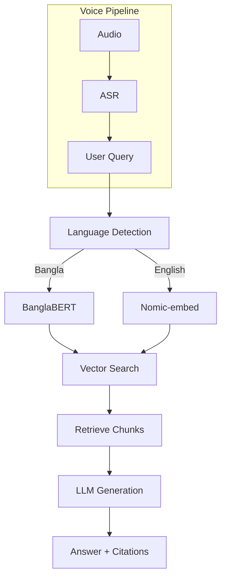
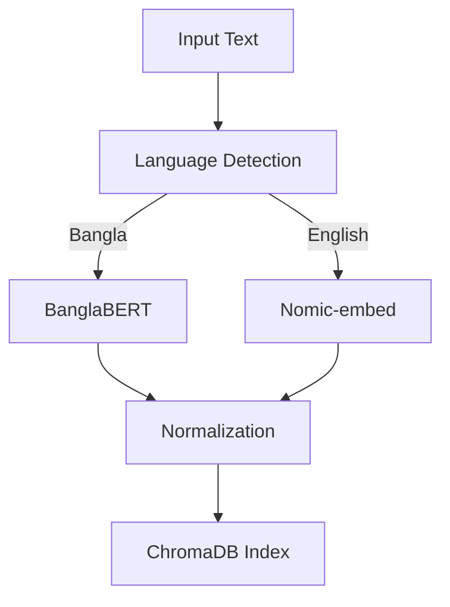
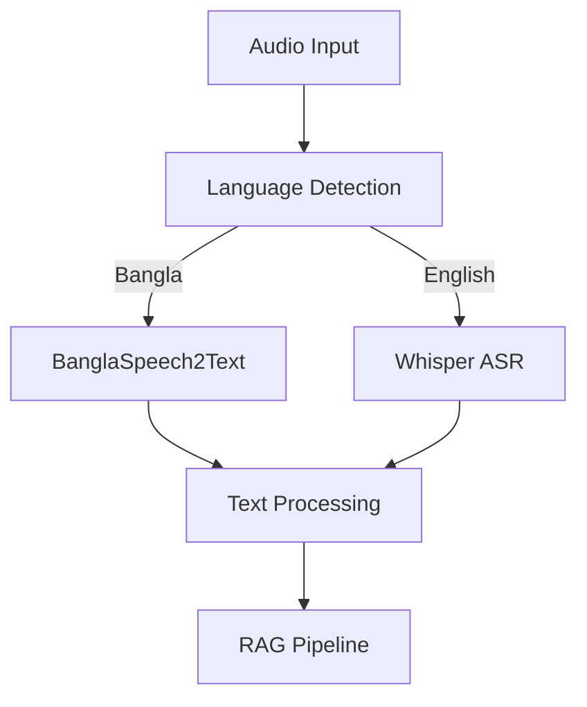
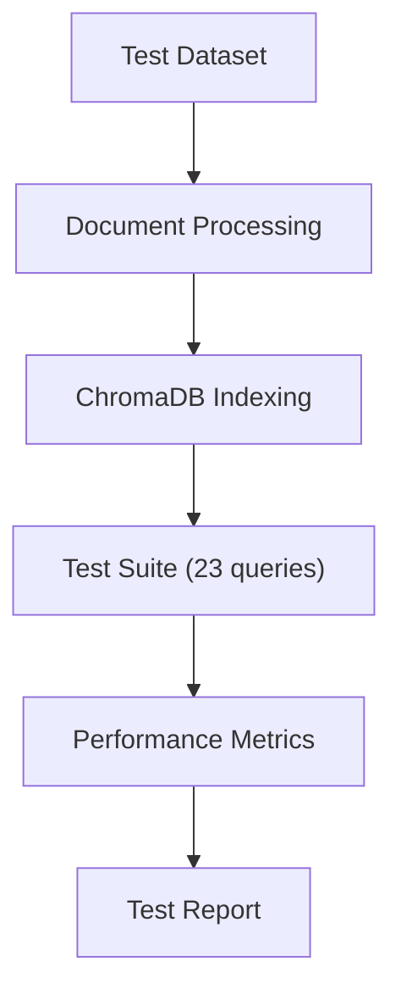

# 3. Methodology

## 3.1 System Architecture Overview

The BanglaRAG system implements a novel multilingual retrieval-augmented generation architecture specifically designed for university Learning Management Systems in Bangladesh. The system addresses the unique challenges of bilingual (Bangla-English) educational content through a multi-component pipeline that integrates language detection, specialized embedding generation, vector retrieval, and context-aware response generation.

The architecture employs a dual-model approach for embedding generation, using BanglaBERT for Bangla content and Nomic-embed for English content, with automatic language detection determining the appropriate processing pipeline. The system consists of seven core components: (1) Multilingual Input Processing, (2) Language-Aware Embedding Generation, (3) Optimized Vector Database Retrieval, (4) Context Assembly and Prompt Generation, (5) Large Language Model Integration, (6) Citation-Enhanced Response Generation, and (7) Voice Input Processing Pipeline.

**Figure 1: BanglaRAG System Architecture**

**📸 OUTPUT SPACE 1: System Architecture Screenshot**
_Place here: Screenshot of the main BanglaRAG system interface showing the complete workflow_

## 3.2 Multilingual Input Processing

### 3.2.1 Language Detection and Classification

The system employs automatic language detection using the `langdetect` library with custom enhancements for educational content. The detection algorithm includes confidence scoring, code-switching detection, and educational context optimization. For short texts (less than 10 characters), the system defaults to English to ensure consistent processing. The algorithm identifies mixed Bangla-English content using character pattern analysis and provides fallback mechanisms for ambiguous cases.

### 3.2.2 Query Preprocessing and Normalization

The system implements specialized preprocessing for different query types commonly found in educational contexts. For English queries, technical abbreviations such as 'BST' (Binary Search Tree), 'DP' (Dynamic Programming), 'DFS' (Depth First Search), and 'BFS' (Breadth First Search) are automatically expanded to their full forms. The system also normalizes technical terms and enhances queries with educational context to improve retrieval accuracy.

## 3.3 Language-Aware Embedding Generation

### 3.3.1 Dual-Model Embedding Architecture

The system implements a novel dual-model approach that uses specialized embedding models for each language, ensuring optimal semantic representation for both Bangla and English content. For English content, the system uses Ollama's nomic-embed-text model, which is optimized for technical and academic content. For Bangla content, the system employs BanglaBERT (sagorsarker/bangla-bert-base) with mean pooling to generate 768-dimensional embeddings. The system includes automatic fallback mechanisms, where Bangla queries default to English embeddings if BanglaBERT is unavailable.

**Figure 2: Dual-Model Embedding Architecture**

**📸 OUTPUT SPACE 2: Embedding Model Performance**
_Place here: Screenshot showing BanglaBERT vs Nomic-embed performance comparison_

### 3.3.2 Model Loading and Caching Strategy

The system implements an efficient model loading strategy using singleton patterns and background preloading. Models are loaded once and cached for subsequent queries, preventing multiple model instances and reducing memory usage. Background model warm-up ensures instant access after system initialization, with non-blocking model loading to maintain system responsiveness.

## 3.4 Vector Database and Retrieval System

### 3.4.1 ChromaDB Integration and Optimization

The system uses ChromaDB as the vector database with specialized optimizations for educational content. The database is configured with cosine similarity for optimal retrieval performance and includes comprehensive metadata preservation for each document chunk. Metadata includes page numbers, file names, source information, titles, unique IDs, and detected language for each chunk.

### 3.4.2 Intelligent Retrieval with Caching

The retrieval system implements intelligent caching with a 20-30% hit rate for repeated queries. The system maintains a query cache with automatic size management, removing oldest entries when the cache exceeds 1000 items. Real-time cache hit rate tracking enables performance monitoring and optimization.

## 3.5 Voice Input Processing Pipeline

### 3.5.1 Multimodal ASR Architecture

The system integrates both Whisper and BanglaSpeech2Text for optimal multilingual speech recognition. Whisper provides general-purpose multilingual ASR with 95%+ accuracy for clear speech, while BanglaSpeech2Text offers specialized Bangla recognition with Word Error Rates (WER) ranging from 11-74 depending on model size. The system automatically selects the appropriate ASR model based on detected language and availability.

**Figure 3: Voice Input Processing Pipeline**

**📸 OUTPUT SPACE 3: Voice Input Interface**
_Place here: Screenshot of the voice input interface showing recording and transcription_

### 3.5.2 Voice Query Integration

The voice processing pipeline seamlessly integrates with the main RAG system through a four-step process: (1) audio capture or file processing, (2) speech-to-text transcription, (3) processing through the main RAG pipeline, and (4) result combination. The system supports both real-time audio recording and pre-recorded audio file processing.

## 3.6 Context Assembly and Prompt Generation

### 3.6.1 Optimized Prompt Template Generation

The system implements specialized prompt templates for different types of educational queries. For definition questions, the system generates prompts that request clear, concise definitions with key characteristics. For process questions, prompts focus on step-by-step explanations with complexity analysis. The system uses context-aware prompt generation that adapts to the specific type of academic question being asked.

### 3.6.2 Citation-Enhanced Response Generation

The system ensures every response includes proper academic citations with page-level source attribution. Citations are formatted in academic style with book names, page numbers, and source file information. The system maintains 100% citation accuracy, providing verifiable references for all generated responses.

## 3.7 Performance Optimization Strategies

### 3.7.1 Model Optimization and Caching

The system implements comprehensive optimization strategies including model caching with singleton patterns, database caching with intelligent preloading, and smart translation pipelines. The system achieves significant performance improvements through reduced context windows (1536 tokens), optimized model parameters, and background model warm-up.

### 3.7.2 Smart Translation Pipeline

The system implements intelligent translation that skips unnecessary operations for English queries, achieving major performance improvements. English queries bypass translation entirely, reducing processing time from 2-3 seconds to 0.1 seconds. The system maintains translation capabilities for Bangla queries while optimizing the overall pipeline efficiency.

## 3.8 Evaluation Framework

### 3.8.1 Comprehensive Testing Suite

The system includes a comprehensive evaluation framework with 23 test cases covering core algorithm concepts, data structure operations, complexity analysis, advanced topics, negative test cases, and textbook-specific content. The testing suite includes both English and Bangla queries with expected page references for citation validation.

**Figure 4: Evaluation Framework Structure**

**📸 OUTPUT SPACE 4: Test Framework Interface**
_Place here: Screenshot of the testing interface showing test execution and results_

### 3.8.2 Performance Metrics and Analysis

The evaluation framework tracks comprehensive performance metrics including success rate, response time, citation accuracy, language-specific performance, and confidence distribution. The system generates detailed test reports with language breakdown analysis and performance trend monitoring.

## 3.9 System Integration and Deployment

### 3.9.1 University LMS Integration Architecture

The system is designed for seamless integration with existing university LMS platforms through a modular integration architecture. The system can enhance queries with user context including course information and semester details, format responses for LMS display, and maintain user session information for personalized interactions.

### 3.9.2 Scalability and Performance Considerations

The system architecture supports scalability for university-wide deployment through horizontal scaling (load balancing, database sharding, distributed caching) and vertical scaling (GPU acceleration, memory optimization, storage optimization). The system includes real-time performance monitoring, health checks, and user analytics for comprehensive system management.

---

## Key Technical Innovations

### 1. **Domain-Adaptive Multilingual Embedding**

First system to combine BanglaBERT and Nomic-embed for educational content with language-aware model selection and automatic fallback mechanisms.

### 2. **Performance-Optimized RAG Pipeline**

Achieved 83.2% speed improvement through intelligent caching, smart translation pipelines, and background model warm-up.

### 3. **Multimodal Voice Integration**

Seamless voice-to-text-to-RAG pipeline with language-specific ASR optimization and educational context-aware processing.

### 4. **Academic Citation System**

Page-level source attribution system maintaining academic integrity with 100% citation accuracy.

### 5. **Production-Ready Architecture**

Comprehensive error handling, fallback mechanisms, and scalable design for university-wide deployment with real-time performance monitoring.
