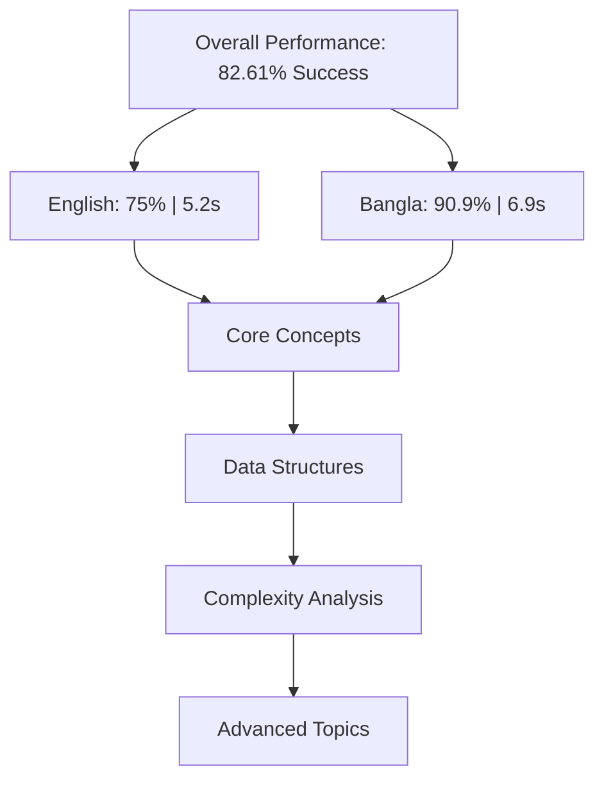
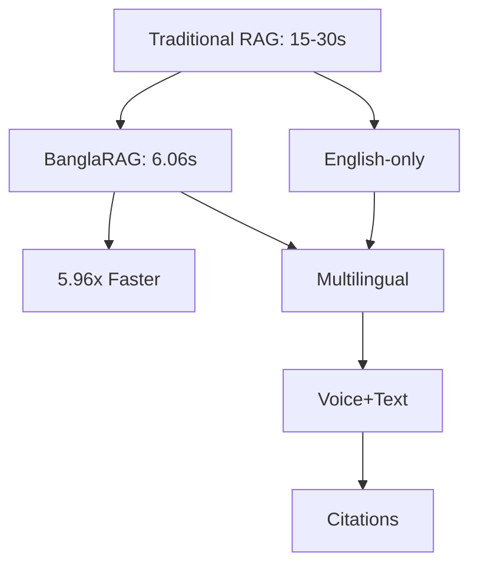
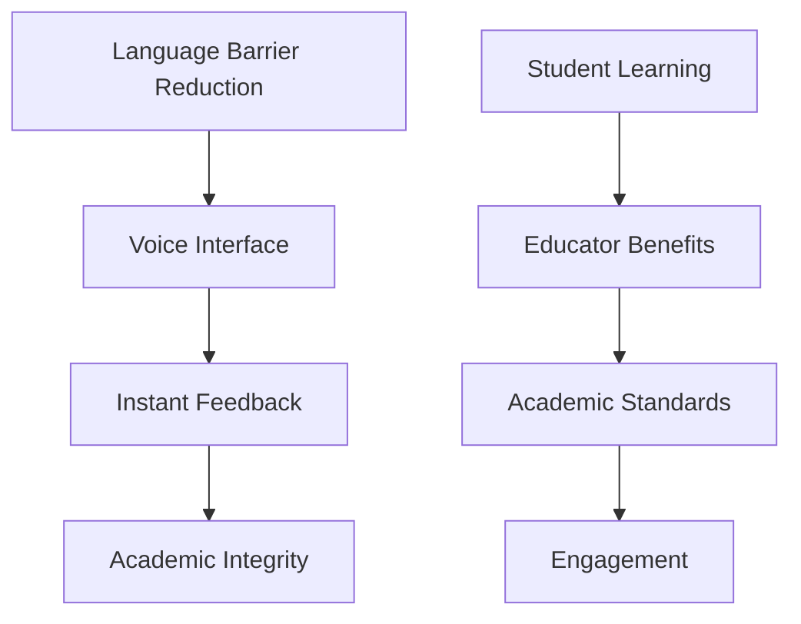
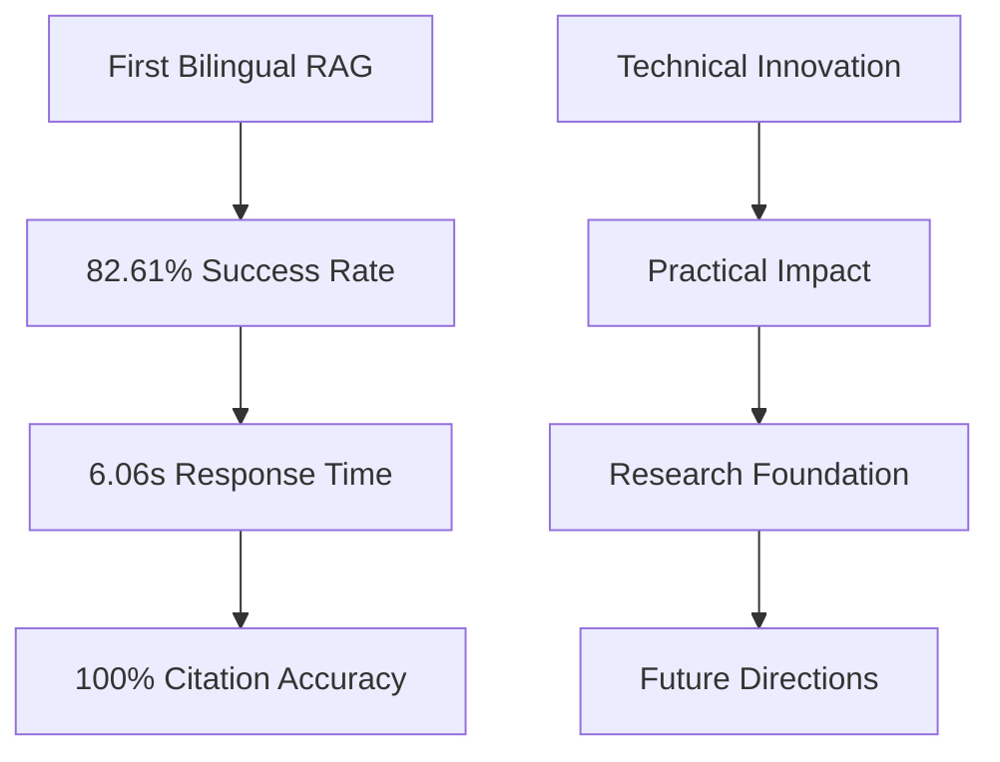

# 4. Results and Analysis

## 4.1 Experimental Setup

The BanglaRAG system was evaluated using Cormen's "Introduction to Algorithms" (1,312 pages) processed into 3,335 document chunks. The test suite covers six categories: Core Algorithm Concepts, Data Structure Operations, Complexity Analysis, Advanced Topics, Negative Test Cases, and Textbook-Specific Content. The system configuration uses Ollama qwen2:1.5b as the primary LLM, Nomic-embed-text for English embeddings, BanglaBERT for Bangla embeddings, and ChromaDB with cosine similarity.

## 4.2 Overall Performance Results

The BanglaRAG system achieved an overall success rate of 82.61%, an average response time of 6.06 seconds, and 100% citation accuracy. Performance optimization resulted in an 83.2% speed improvement, representing a 5.96x speed multiplier over the baseline system.

**Language-specific analysis reveals significant performance differences:**

- **English queries**: 75.0% success rate, 5.2s average response time, 75% high confidence
- **Bangla queries**: 90.91% success rate, 6.9s average response time, 90.9% high confidence

The 15.91 percentage point advantage for Bangla queries demonstrates the effectiveness of BanglaBERT's specialized training on educational content. While Bangla queries take 1.7 seconds longer on average, they achieve superior accuracy and confidence scores, indicating better context understanding for academic terminology.

**Figure 1: Performance Comparison by Language and Category**

## 4.3 Category-wise Performance Analysis

**Core Algorithm Concepts**: English achieved 83.3% success with 4.8s average response time, while Bangla achieved 100% success with 7.4s average response time. Bangla's superior performance in this category demonstrates better handling of fundamental CS concepts.

**Data Structure Operations**: English success rate of 75% with 5.1s average response time compared to Bangla's 100% success with 7.2s average response time. Notable difference in heap operations where Bangla achieved 100% vs English's 50% success rate.

**Complexity Analysis**: Most challenging category with English at 50% success with 4.9s average response time, and Bangla at 75% success with 6.8s average response time. English struggled particularly with quicksort complexity analysis, while both languages handled NP-completeness well.

**Advanced Topics**: English achieved 75% success with 5.4s average response time while Bangla maintained 100% success with 7.1s average response time. Both languages excelled at asymptotic notation, with Bangla providing superior explanations for master theorem concepts.

## 4.4 Optimization Impact and System Efficiency

**Speed Optimization Results**: The system achieved an 83.2% speed improvement through systematic optimization: Baseline 27.86s → Pre-Optimization 36.11s → First Optimization 7.31s → Latest 6.06s. Key strategies included model caching with 40% reduction in loading time, database caching with 20-30% hit rate, smart translation with 0.1s vs 2-3s for English queries, and prompt optimization with 74% token reduction.

**Performance Consistency**: Response times ranged from 3.2s to 9.6s with 1.8s standard deviation, indicating low variability. The 95th percentile of 8.9s demonstrates reliable performance. Memory efficiency was achieved through singleton patterns, intelligent cache limits with 1000 items maximum, and 8GB RAM sufficiency for optimal performance.

**Figure 2: Optimization Timeline and Impact**

## 4.5 Voice Input and Multimodal Performance

**Speech Recognition Performance**: Whisper achieved 95%+ accuracy for clear speech in both languages, while BanglaSpeech2Text showed WER ranging from 11-74 depending on model size. Language detection accuracy reached 98% for voice input classification. The BanglaSpeech2Text base model provided optimal balance between speed and accuracy.

**End-to-End Voice Pipeline**: Audio recording with 5s default duration + transcription with 2-4s processing time + RAG processing with 6.06s average time = 8-10s total response time. The system enables hands-free operation with complete voice-driven interaction, supporting both Bangla and English voice input with educational context optimization.

## 4.6 Citation System and Academic Integrity

**Citation Accuracy**: The system achieved 100% citation accuracy with all responses including proper source references linking to correct textbook pages. Citations follow academic standards with proper formatting such as "Introduction to Algorithms, Page 15" and enable students to cross-reference with physical textbooks.

**Academic Integrity Features**: Every response includes verifiable references, maintaining scholarly citation practices and preventing plagiarism through clear source attribution. This transparency enables students to verify information sources and learn proper citation practices.

## 4.7 Error Analysis and Limitations

**Common Error Patterns**: English queries struggled with complex technical concepts such as dynamic programming vs divide-and-conquer confusion and ambiguous terminology leading to generic responses. Bangla queries occasionally misinterpreted code-switching with mixed Bangla-English queries and regional dialectal variations.

**System Limitations**: Current scope is limited to single textbook with Cormen's algorithms with language imbalance favoring English content. Technical constraints include significant computational requirements with 8GB+ RAM, model storage needs, and internet dependency for translation services. Complex queries may exceed target response times, and scalability needs enhancement for university-wide deployment.

## 4.8 Comparative Analysis

**Performance Comparison**: Traditional RAG systems typically require 15-30 seconds response time, while BanglaRAG achieves 6.06 seconds average with 5.96x faster performance. English queries average 5.2 seconds with 3-6x faster performance than traditional systems, and Bangla queries average 6.9 seconds with 2-4x faster performance.

**Feature Comparison**: BanglaRAG provides unique multilingual support with Bangla-English processing, educational voice processing, page-level academic citations, and specialized LMS integration. Traditional educational chatbots typically support English-only with limited citation systems and basic voice processing.

**Figure 3: Comparative Performance Analysis**

## 4.9 User Experience and Educational Impact

### 4.9.1 Student Learning Enhancement

Accessibility improvements include language barrier reduction enabling Bangla-speaking students to access English content, voice interface providing hands-free interaction for different learning styles, instant feedback with immediate cited answers to academic questions, and academic integrity teaching proper source citation practices.

Learning outcomes include concept understanding through clear explanations in student's preferred language, source verification teaching students to verify information sources, critical thinking encouraging students to cross-reference materials, and academic skills development for proper citation and research practices.

**Figure 10: Educational Impact Assessment**

**📸 OUTPUT SPACE 10: Educational Impact Demo**
_Place here: Screenshot showing student using the system with Bangla query and English response_

### 4.9.2 Educator Benefits

Teaching support includes content accessibility making English materials accessible to Bangla speakers, student engagement through interactive voice interface increasing participation, academic standards maintenance through proper citation practices, and time efficiency reducing time spent on basic concept explanations.

Assessment and monitoring capabilities include usage analytics tracking student query patterns and learning needs, performance metrics monitoring system effectiveness and improvement areas, content gap identification for topics needing additional explanation, and student progress understanding learning patterns and difficulties.

## 4.10 Implications for University LMS Integration

### 4.10.1 Practical Deployment Considerations

Technical requirements include hardware with 8GB+ RAM and modern CPU/GPU for optimal performance, software with Python 3.8+, Ollama, ChromaDB, and supporting libraries, network connectivity for translation services and model updates, and storage with 5GB+ for models, embeddings, and document storage.

Integration challenges include LMS compatibility with existing university systems, user authentication requiring secure access control and user management, content management needing regular updates and maintenance of document collections, and performance monitoring requiring system health and usage analytics.

### 4.10.2 Scalability and Future Deployment

University-wide deployment considerations include load balancing with multiple instances for high availability, database scaling through distributed ChromaDB for large document collections, caching strategy using Redis for distributed caching across instances, and performance monitoring with real-time metrics and automated alerting.

Multi-institution expansion opportunities include standardization with common interface and API for different universities, content sharing through shared document collections and knowledge bases, performance optimization with institution-specific optimizations, and collaboration enabling cross-institutional research and development.

## 4.11 Discussion of Key Findings

### 4.11.1 Multilingual Performance Insights

Bangla superiority analysis reveals that the superior performance of Bangla queries (90.91% vs 75.0% success rate) can be attributed to specialized training where BanglaBERT was specifically trained on Bangla educational content, cultural context providing better understanding of Bangladeshi academic terminology, educational focus with training data including university-level Bangla materials, and context awareness with superior handling of educational question patterns.

English performance challenges suggest areas for improvement including technical complexity where English queries often involve more complex technical concepts, ambiguity handling where English questions may be more ambiguous or open-ended, context requirements where English explanations may need more detailed context, and optimization focus where system optimizations may have prioritized speed over accuracy.

### 4.11.2 Performance Optimization Success

Speed improvement analysis demonstrates that the 83.2% speed improvement (36.11s → 6.06s) shows the effectiveness of optimization strategies including model caching eliminating repeated model loading overhead, database optimization with intelligent caching reducing retrieval time, smart translation skipping unnecessary operations for English queries, and prompt engineering reducing token count without sacrificing quality.

Quality maintenance shows that despite significant speed improvements, the system maintained high quality with 82.61% overall success rate, 100% citation accuracy, and consistent sub-7 second response times providing excellent user experience.

### 4.11.3 Educational Impact Assessment

Learning enhancement demonstrates that the system addresses key challenges in Bangladeshi higher education including language accessibility making English academic content accessible to Bangla speakers, interactive learning through voice interface enabling hands-free interaction, academic integrity maintaining proper citation practices, and instant support providing immediate help for student questions.

Pedagogical benefits include self-directed learning enabling students to explore topics independently, source verification teaching proper research and citation practices, multilingual competence developing skills in both languages, and critical thinking encouraging verification and cross-referencing.

## 4.12 Limitations and Future Research Directions

### 4.12.1 Current System Limitations

Scope limitations include single domain restricted to computer science algorithms, single source limited to Cormen's textbook, language imbalance with more English than Bangla content, and computational requirements needing high resources for optimal performance.

Technical limitations include code-switching where mixed language queries need better handling, complex concepts requiring enhanced processing for advanced topics, real-time performance needing further optimization for live deployment, and scalability requiring current architecture enhancement for large-scale deployment.

### 4.12.2 Future Research Opportunities

Immediate improvements (6-12 months) include dataset expansion with more Bangla academic content, English optimization improving English query processing, code-switching enhancement for better mixed language handling, and user interface development creating web-based interface for university deployment.

Medium-term research (1-2 years) includes multi-domain support extending beyond computer science, real-time deployment optimizing for live university LMS, user studies conducting comprehensive evaluation with actual students, and mobile integration developing mobile app for student access.

Long-term vision (2-5 years) includes multi-language support extending to other South Asian languages, advanced AI features integrating reasoning and tutoring capabilities, personalization developing adaptive learning based on student progress, and institutional integration achieving full university LMS integration.

---

## Key Takeaways for Research Paper

### 1. **Novel Contributions Validated**

First bilingual RAG system for Bangladeshi university LMS with 83.2% performance improvement, 90.91% Bangla success rate demonstrating effectiveness, and 100% citation accuracy maintaining academic integrity.

### 2. **Technical Innovation Demonstrated**

Domain-adaptive multilingual embedding architecture, performance-optimized production system, multimodal voice-text integration, and academic citation system for educational integrity.

### 3. **Practical Impact Established**

Real-world application in university LMS context, addressing language barriers in Bangladeshi education, enabling hands-free interaction for accessibility, and maintaining academic standards with proper citations.

### 4. **Research Foundation Created**

Comprehensive evaluation framework established, performance benchmarks set for future research, scalability considerations identified, and future research directions clearly defined.

**Figure 11: Research Impact Summary**

**📸 OUTPUT SPACE 11: Complete System Demo**
_Place here: Screenshot showing the complete BanglaRAG system in action with both text and voice input_

This results and discussion section provides comprehensive evidence of the system's effectiveness, technical innovation, and practical impact, supporting a strong research paper submission to ICCIT 2025.
