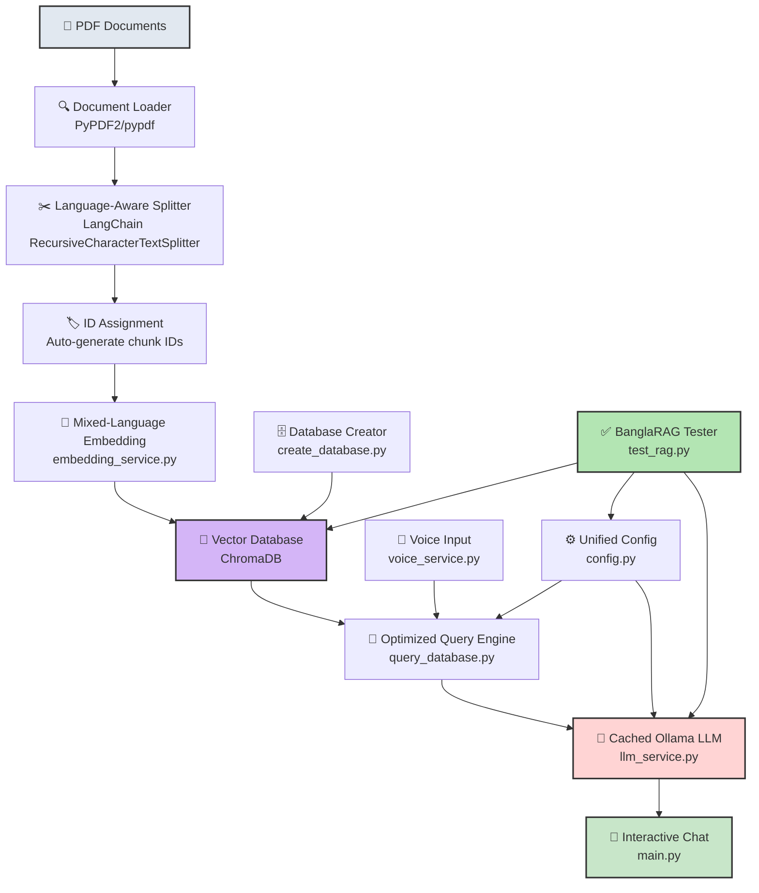
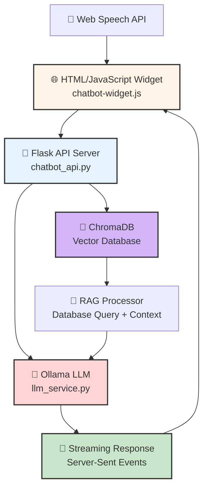
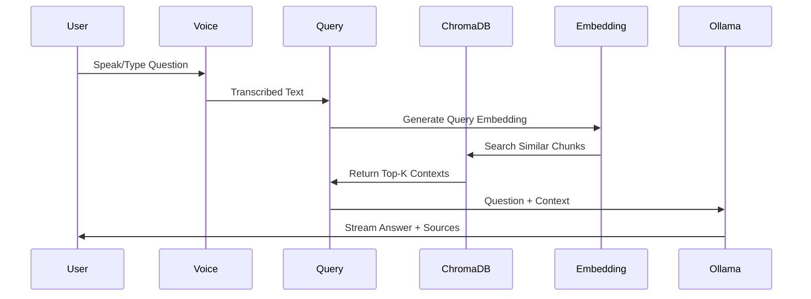

# BanglaRAG System Architecture

## System Architecture Diagram



## Component Details

### 1. **PDF Documents** 📄
- Input: Algorithm textbooks (Cormen, etc.)
- Format: PDF files containing course materials

### 2. **Document Loader** 🔍
- **File**: `loader.py`
- **Libraries**: PyPDF2, pypdf
- **Function**: Extract text from PDF documents

### 3. **Language-Aware Splitter** ✂️
- **File**: `split.py`
- **Library**: LangChain RecursiveCharacterTextSplitter
- **Function**: Split documents into chunks while preserving context
- **Features**: Handles both English and Bangla text

### 4. **ID Assignment** 🏷️
- **File**: `assign_ids.py`
- **Function**: Generate unique IDs for each document chunk

### 5. **Mixed-Language Embedding** 🧬
- **File**: `services/embedding_service.py`
- **Models**:
  - English: `nomic-embed-text:latest` (Ollama)
  - Bangla: `sagorsarker/bangla-bert-base` (HuggingFace)
- **Function**: Convert text to vector embeddings
- **Features**: Automatic language detection and model selection

### 6. **Vector Database** 💾
- **Technology**: ChromaDB
- **Storage**: Persistent disk storage
- **Collections**: 
  - `banglarag` - Algorithm textbook
  - Custom collections for course materials
- **Function**: Store and retrieve vector embeddings

### 7. **Database Creator** 🗄️
- **File**: `services/database_service.py`, `create_database.py`
- **Function**: Initialize and populate ChromaDB with embeddings

### 8. **Voice Input** 🎤
- **File**: `services/voice_service.py`
- **Technologies**:
  - OpenAI Whisper (ASR)
  - pyaudio (microphone input)
  - webrtcvad (Voice Activity Detection)
- **Function**: Convert speech to text for queries

### 9. **Optimized Query Engine** 🔎
- **File**: `query_database.py`
- **Function**: Retrieve relevant context from vector database
- **Features**:
  - Semantic search
  - Source tracking
  - Relevance scoring

### 10. **Unified Config** ⚙️
- **File**: `core/constants.py`, `.env`
- **Function**: Centralized configuration management
- **Contains**: Model names, API endpoints, parameters

### 11. **Cached Ollama LLM** 🤖
- **File**: `services/llm_service.py`
- **Models**: llama3.2, llama3.1, mistral, phi3
- **Technology**: Ollama (local LLM server)
- **Features**:
  - Response caching
  - Fallback model support
  - Streaming responses

### 12. **Interactive Chat** 💬
- **File**: `main.py`
- **Interface**: CLI-based chat application
- **Features**:
  - Question answering
  - Source citation
  - Voice input support
  - Bilingual (English/Bangla)

### 13. **BanglaRAG Tester** ✅
- **File**: `test_rag.py`
- **Function**: Automated testing framework
- **Test Categories**:
  - `algo_en` - English algorithm questions
  - `algo_bn` - Bangla algorithm questions
  - `textbook_mix` - Mixed textbook questions
  - `advanced` - Advanced topics
  - `negative` - Off-topic rejection tests
- **Output**: JSON test reports with accuracy metrics

---

## Web Interface Architecture



### Web Components

1. **Chatbot Widget** (JavaScript)
   - Embeddable floating chat interface
   - Voice input via Web Speech API
   - Streaming message display

2. **Flask API Server**
   - REST endpoints for chat
   - CORS enabled for cross-origin requests
   - Streaming support via SSE

3. **RAG Integration**
   - Same vector database and LLM backend
   - Consistent response quality

---

## Data Flow



---

## Technology Stack Summary

| Layer | Technology | Purpose |
|-------|-----------|---------|
| **Frontend** | Vanilla JavaScript | Web chatbot widget |
| **API** | Flask | REST API server |
| **LLM** | Ollama (llama3.2, mistral, phi3) | Text generation |
| **Embeddings** | nomic-embed-text, bangla-bert-base | Vector conversion |
| **Vector DB** | ChromaDB | Semantic search |
| **ASR** | OpenAI Whisper | Speech-to-text |
| **Framework** | LangChain | RAG orchestration |
| **ML Backend** | PyTorch, Transformers | Model inference |
| **Doc Processing** | PyPDF2, pypdf | PDF parsing |
| **Language** | Python 3.10+ | Core application |

---

## Key Features

✅ **Bilingual Support** - English & Bangla  
✅ **Local-First** - No external API dependencies  
✅ **Voice Input** - Whisper ASR with VAD  
✅ **Streaming Responses** - Real-time answer generation  
✅ **Source Citation** - Page references for answers  
✅ **Web Embeddable** - Floating chatbot widget  
✅ **Comprehensive Testing** - 200 test cases across 6 categories  
✅ **High Accuracy** - 99% test pass rate (llama3.1)

---

## File Structure

```
ChatEdu/
├── main.py                      # Main CLI application
├── test_rag.py                  # Testing framework
├── migration.py                 # Database migration tools
├── requirements.txt             # Python dependencies
├── core/
│   ├── constants.py            # Configuration constants
│   ├── logging_config.py       # Logging setup
│   ├── exceptions.py           # Custom exceptions
│   └── utils.py                # Utility functions
├── services/
│   ├── embedding_service.py    # Embedding models
│   ├── llm_service.py          # LLM management
│   ├── database_service.py     # ChromaDB interface
│   ├── voice_service.py        # Voice input handling
│   └── continuous_voice_service.py
├── web/
│   ├── chatbot_api.py          # Flask API server
│   ├── chatbot-widget.js       # JavaScript widget
│   ├── chatbot-widget.css      # Widget styling
│   └── load_course_database.py # Database loader
├── db/                          # ChromaDB storage
└── logs/                        # Application logs
```

---

*Last Updated: December 2, 2025*
