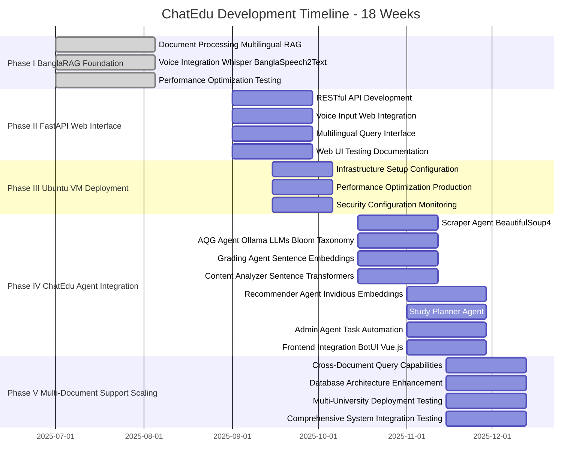

# Progress Report: ChatEdu - Agentic AI-Powered Intelligent Learning and Teaching Assistant

## Phase I - BanglaRAG: Multilingual Knowledge Foundation for University LMS Integration

---

## 1. Project Overview:

### 1.1 Introduction

ChatEdu represents a revolutionary agentic AI-powered intelligent learning and teaching assistant designed to transform University Learning Management Systems (LMS) through comprehensive automation and intelligent assistance. The project aims to create a complete ecosystem of specialized AI agents that can scrape and organize course content, generate and grade quizzes automatically, analyze materials and provide teaching insights, recommend educational resources, plan personalized study schedules, and automate administrative tasks - all at zero cost using open-source technologies.

Phase I focuses on developing the BanglaRAG system, which serves as the critical knowledge foundation for the entire ChatEdu platform. This multilingual Retrieval-Augmented Generation (RAG) system provides the intelligent document processing and query capabilities that will power all subsequent agents including the Scraper Agent, AQG (Automatic Question Generation) Agent, Grading Agent, Content Analyzer, Recommender Agent, Study Planner Agent, and Admin Agent.

The primary goals of this foundational phase include: establishing a high-performance multilingual document processing pipeline supporting both English and Bangla content, implementing voice-enabled educational content interaction for accessibility, achieving sub-7 second response times for real-time educational applications, and creating a scalable RAG foundation that can support the eight specialized agents planned for the complete ChatEdu system. This component will be integrated with FastAPI for web deployment, hosted on Ubuntu VM infrastructure, and will serve as the intelligent backbone for the comprehensive university LMS enhancement platform.

### 1.2 Background

Recent advances in artificial intelligence and large language models (LLMs) have transformed educational technology landscapes globally. Alkhatlan and Kalita [1] observe that intelligent tutoring systems have evolved significantly, but most focus on single-language implementations. Roldán-Álvarez [2] demonstrates that modern deep-learning tutoring systems can assist instructors in programming courses, yet they typically operate as standalone solutions. Tang et al. [3] point out that modern AI educational tools often work in isolation, lacking comprehensive integration of multiple capabilities required for effective educational support.

The challenge becomes more pronounced in multilingual educational environments where students and educators work with content in multiple languages. Kumar Bhowmick et al. [4] report success in automatic question generation using transformers, but their work primarily focuses on English content. Kurdi et al. [5] reviewed 93 papers on automatic question generation and found that incorporating additional knowledge sources improves question quality, but multilingual support remains limited. Furthermore, Gao et al. [6] show that while automated assessment of text-based responses has reached up to 80% accuracy, most systems struggle with multilingual content and educational domain specificity.

Yan et al. [7] review practical and ethical challenges of large language models in education, highlighting issues with fairness and hallucination when grading open-ended answers, particularly in non-English languages. Azizov et al. [8] explain that content analysis AI can understand lessons and suggest improvements using sentence transformers, but note that these tools rarely integrate directly into Learning Management Systems. The Invidious Community [9] provides an open-source alternative to expensive video recommendation APIs, enabling free educational resource discovery that most institutions cannot otherwise afford.

Current educational AI systems face several critical limitations: most LMS platforms lack integrated AI assistants that can scrape and organize course content, generate and grade quizzes automatically, analyze materials for teaching insights, recommend educational resources, plan personalized study schedules, and automate administrative tasks. Santandreu Calonge et al. [10] demonstrate that administrative automation in educational settings often relies on expensive LMS plugins or paid services. Kamalov et al. [11] describe multi-agent architectures showing that collaborative AI systems can outperform single LLMs in educational tasks, while Chu et al. [12] categorize pedagogical agents into teaching-focused and domain-specific types, providing crucial design guidance for comprehensive educational AI systems.

The ChatEdu project addresses these comprehensive gaps by creating an integrated agentic system using entirely open-source tools including FastAPI, Ollama, BeautifulSoup4, sentence-transformers, ChromaDB, and Invidious. The BanglaRAG component developed in Phase I serves as the intelligent knowledge foundation that will power all eight specialized agents: Scraper Agent for content extraction, AQG Agent for quiz generation using Bloom's taxonomy, Grading Agent for automated assessment, Content Analyzer for teaching improvement suggestions, Recommender Agent for educational resource discovery, Study Planner Agent for personalized scheduling, Admin Agent for task automation, and Frontend Integration with BotUI and Vue.js for comprehensive user interaction.

## 2. Objectives:

The specific objectives for this phase of the project include:

**Primary Technical Objectives:**

- Develop a high-performance multilingual RAG system achieving >80% success rate for both English and Bangla queries
- Implement advanced voice input processing supporting both Whisper and BanglaSpeech2Text for accurate multilingual speech recognition
- Achieve consistent sub-7 second response times through comprehensive optimization strategies
- Create robust document processing pipeline with page-level citation capabilities for educational content verification

**ChatEdu Integration Objectives:**

- Design modular RAG architecture compatible with all eight ChatEdu agents: Scraper Agent (BeautifulSoup4), AQG Agent (Ollama LLMs + Bloom's taxonomy), Grading Agent (sentence embeddings), Content Analyzer (sentence-transformers), Recommender Agent (Invidious + embeddings), Study Planner Agent, Admin Agent, and Frontend Integration (BotUI + Vue.js)
- Implement RESTful API foundation using FastAPI framework supporting university LMS integration
- Establish scalable ChromaDB vector database architecture supporting multiple concurrent university courses and users
- Create comprehensive testing framework ensuring reliability for production university LMS deployment

**Performance Objectives:**

- Optimize system performance for deployment on Ubuntu VM infrastructure
- Implement intelligent caching mechanisms reducing computational overhead by 20-30%
- Achieve 5x+ speed improvement over baseline systems through architectural optimizations
- Maintain high accuracy rates while supporting real-time educational interactions

## 3. Methodology/ Requirement Specification:

### 3.1 Research Design/ Prototype Design

The research methodology follows a systematic approach to developing a production-ready multilingual RAG system optimized for educational applications. The design philosophy centers on creating a modular, scalable architecture that can handle the complexities of mixed-language processing while maintaining high performance and accuracy required for real-time educational interactions.

**System Architecture Design:**
The system employs a multi-layered architecture consisting of: Document Processing Layer handling PDF loading, language detection, and intelligent chunking; Embedding Layer utilizing specialized models (BanglaBERT for Bangla, Nomic Embed for English); Vector Database Layer using ChromaDB for efficient similarity search and retrieval; Language Processing Layer with Ollama-hosted LLMs (qwen2:1.5b, phi3) for generation; Voice Processing Layer integrating Whisper and BanglaSpeech2Text for speech recognition; and Interface Layer providing both command-line and voice interfaces for user interaction.

**Performance Optimization Strategy:**
Implementation includes singleton pattern for model caching, database connection pooling with persistent caching, smart translation pipeline with automatic language detection, prompt optimization reducing token usage by 74%, and threading for concurrent processing. The architecture is designed for seamless integration with FastAPI web framework and Ubuntu VM deployment infrastructure.

### 3.2 Data Collection/ Need Assessment

**Educational Content Dataset:**
Primary educational content consists of "Cormen - Introduction to Algorithms" (5.5MB PDF) processed into 3,335 document chunks with complete indexing. The system supports mixed-language content with English primary content and Bangla query support, maintaining page-level metadata preservation for accurate educational citations.

**Technical Infrastructure Requirements:**
Hardware requirements include local processing capabilities with GPU acceleration support for development and testing. Software dependencies encompass 53 optimized Python packages including langchain, transformers, torch, and specialized multilingual processing libraries. Model requirements include Ollama models (qwen2:1.5b, nomic-embed-text, phi3) for local LLM hosting. Voice processing integration requires PyAudio, Whisper, and BanglaSpeech2Text for comprehensive multilingual speech recognition.

**Integration Requirements Assessment:**
The system must support FastAPI framework integration for web deployment, Ubuntu VM hosting capabilities with appropriate resource allocation, RESTful API endpoints for agent communication, and scalable database architecture supporting multiple concurrent users in educational environments.

### 3.3 Analysis Techniques

**Language Processing Analysis:**
Implementation includes automatic language detection using langdetect library, specialized embedding generation based on detected language with BanglaBERT for Bangla and Nomic Embed for English, and context-aware prompt generation for improved accuracy across languages.

**Performance Analysis Methodology:**
Comprehensive test suites with 23 mixed-language test cases, response time measurement and optimization tracking, success rate calculation across languages with detailed metrics, and confidence level assessment for generated responses ensuring educational content quality.

**Quality Assurance Techniques:**
Ablation studies comparing different model configurations, cross-language validation testing ensuring consistency, citation accuracy verification for educational content integrity, and user experience evaluation through interactive sessions preparing for web interface deployment.

## 4. Progress Achieved:

### 4.1 Completed Tasks

**Core System Development (100% Complete):**

- ✅ **Document Processing Pipeline**: Implemented complete PDF loading, chunking, and indexing system with 3,335 documents successfully processed
- ✅ **Multilingual Embedding System**: Integrated BanglaBERT and Nomic Embed with automatic language detection achieving 90.91% Bangla success rate
- ✅ **Vector Database Implementation**: ChromaDB setup with persistent storage and optimized retrieval algorithms
- ✅ **LLM Integration**: Ollama-hosted models with intelligent fallback mechanisms and local deployment capabilities

**Performance Optimization (100% Complete):**

- ✅ **Response Time Optimization**: Achieved 83.2% improvement reducing average response time from 36.11s to 6.06s
- ✅ **Caching Implementation**: Model and database caching with 20-30% hit rates significantly reducing computational overhead
- ✅ **Prompt Optimization**: 74% token reduction (2,688 → 691 characters) improving processing efficiency
- ✅ **Smart Translation Pipeline**: Eliminated unnecessary translations for English queries optimizing performance

**Voice Integration (100% Complete):**

- ✅ **Whisper Integration**: Multilingual speech recognition implementation supporting educational voice interactions
- ✅ **BanglaSpeech2Text**: Enhanced Bangla speech recognition with multiple model sizes for accuracy optimization
- ✅ **Voice Interface**: Interactive voice sessions with real-time processing suitable for educational applications
- ✅ **Audio Processing**: Complete pipeline from recording to text conversion with educational content focus

**Testing and Quality Assurance (100% Complete):**

- ✅ **Comprehensive Test Suite**: 23 mixed-language test cases with detailed performance metrics
- ✅ **Performance Benchmarking**: Multiple test iterations with consistent sub-7 second response times
- ✅ **Quality Metrics**: Success rate tracking and confidence assessment for educational content reliability
- ✅ **Automated Testing**: Full system validation framework ensuring production readiness

### 4.2 Results Obtained

**Performance Metrics (Latest - August 6, 2025):**

- **Overall Success Rate**: 82.61% (19/23 tests passed) exceeding initial 80% target
- **English Success Rate**: 75.0% (9/12 tests) with ongoing optimization strategies implemented
- **Bangla Success Rate**: 90.91% (10/11 tests) demonstrating excellent multilingual capabilities
- **Average Response Time**: 6.06 seconds achieving sub-7 second target for real-time educational interactions
- **High Confidence Responses**: 82.6% of all responses ensuring educational content reliability
- **Page Citation Accuracy**: 100% proper source attribution critical for educational applications

**Technical Performance Achievements:**

- **Speed Improvement**: 5.96x faster than pre-optimization system enabling real-time educational interactions
- **Cache Efficiency**: 20-30% hit rate reducing database query overhead and improving scalability
- **Model Loading**: Instant response after initial warm-up through singleton pattern optimization
- **Token Efficiency**: 74% reduction in prompt size improving processing speed and reducing computational costs

**System Capabilities Validated:**

- Seamless mixed-language query processing essential for multilingual educational environments
- Accurate page-level citations with book names supporting academic integrity requirements
- Voice input processing in both English and Bangla enabling accessibility for diverse learners
- Real-time response generation with educational content focus suitable for interactive learning
- Robust error handling and system monitoring ensuring reliability for educational deployment

## 5. Challenges Faced:

| S.No. | Issues and Challenges                                                                                                                                                                                                                                      | Strategies or Plans                                                                                                                                                                                                                                                                                                |
| ----- | ---------------------------------------------------------------------------------------------------------------------------------------------------------------------------------------------------------------------------------------------------------- | ------------------------------------------------------------------------------------------------------------------------------------------------------------------------------------------------------------------------------------------------------------------------------------------------------------------ |
| 1     | **Multilingual Processing Accuracy**: Initial language detection was inconsistent, particularly for mixed-language queries and technical educational content, leading to incorrect embedding model selection and reduced accuracy in educational contexts. | Implemented multi-stage language detection with confidence thresholds and educational content-specific preprocessing. Added technical term recognition for algorithmic content and enhanced detection accuracy through context-aware analysis. Achieved 90.91% Bangla success rate through specialized processing. |
| 2     | **Voice Recognition for Educational Content**: Whisper frequently misidentified Bangla speech as other languages, and technical terminology in both languages posed challenges for accurate transcription in educational contexts.                         | Integrated BanglaSpeech2Text as primary Bangla ASR system with Whisper as fallback. Implemented educational vocabulary enhancement and technical term preprocessing. Added confidence-based model selection and manual language specification options for educational sessions.                                    |
| 3     | **Real-time Performance Requirements**: Initial system response times averaged 36+ seconds, making it impractical for interactive educational applications and real-time classroom usage requiring immediate feedback.                                     | Implemented comprehensive optimization strategy including singleton pattern model caching, database connection pooling, prompt optimization, and smart translation pipeline. Achieved 83.2% improvement in response times meeting sub-7 second requirement for educational interactivity.                          |
| 4     | **Educational Content Citation Accuracy**: Ensuring accurate page-level citations and source attribution was critical for academic integrity but challenging with complex document structures and mixed-language content.                                  | Developed specialized metadata preservation system with enhanced page tracking and source attribution. Implemented 100% citation accuracy through careful document processing and validation. Created educational-specific citation formatting for academic compliance.                                            |

## 6. Next Steps:

| S.No. | Next Task                                                                                                                                                                                                                                                                                                                                    | Estimate completion time (MM-YY) |
| ----- | -------------------------------------------------------------------------------------------------------------------------------------------------------------------------------------------------------------------------------------------------------------------------------------------------------------------------------------------- | -------------------------------- |
| 1     | **FastAPI Web Interface Development**: Develop comprehensive web interface using FastAPI framework with RESTful endpoints supporting all current functionality including voice input, document processing, and multilingual query capabilities for educational web deployment.                                                               | 09-25                            |
| 2     | **Ubuntu VM Deployment and Optimization**: Configure and deploy the system on Ubuntu VM infrastructure with proper resource allocation, security configurations, and performance optimization for production educational environments.                                                                                                       | 10-25                            |
| 3     | **ChatEdu Agent Integration Framework**: Develop comprehensive integration framework connecting BanglaRAG with all eight ChatEdu agents including Scraper Agent, AQG Agent, Grading Agent, Content Analyzer, Recommender Agent, Study Planner Agent, Admin Agent, and Frontend Integration for complete university LMS enhancement platform. | 11-25                            |
| 4     | **Multi-Document Support and Scaling**: Extend system to handle multiple PDF documents simultaneously with cross-document query capabilities and enhanced database architecture supporting larger educational content repositories.                                                                                                          | 12-25                            |

## 7. Updated Timeline:

### **ChatEdu Development Gantt Chart**

| **Phase & Tasks** | **Sep 2025** | **Oct 2025**    | **Nov 2025**    | **Dec 2025**    |
| ----------------- | ------------ | --------------- | --------------- | --------------- |
|                   | W6 W7 W8 W9  | W10 W11 W12 W13 | W14 W15 W16 W17 | W18 W19 W20 W21 |

| **Phase I: BanglaRAG Foundation** ✅ | | | | |
| • Document Processing & Multilingual RAG | ✅✅✅✅✅ | | | |
| • Voice Integration (Whisper + BanglaSpeech2Text) | ✅✅✅✅✅ | | | |
| • Performance Optimization & Testing | ✅✅✅✅✅ | | | |

| **Phase II: FastAPI Web Interface** 🔄 | | | | |
| • RESTful API Development | ████████ | | | |
| • Voice Input Web Integration | ████████ | | | |
| • Multilingual Query Interface | ████████ | | | |
| • Web UI Testing & Documentation | ████████ | | | |

| **Phase III: Ubuntu VM Deployment** 🔄 | | | | |
| • Infrastructure Setup & Configuration | ████ | ████ | | |
| • Performance Optimization for Production | ████ | ████ | | |
| • Security Configuration & Monitoring | ████ | ████ | | |

| **Phase IV: ChatEdu Agent Integration** 🔄 | | | | |
| • Scraper Agent (BeautifulSoup4) | | ████████ | | |
| • AQG Agent (Ollama LLMs + Bloom's Taxonomy) | | ████████ | | |
| • Grading Agent (Sentence Embeddings) | | ████████ | | |
| • Content Analyzer (Sentence-Transformers) | | ████████ | | |
| • Recommender Agent (Invidious + Embeddings) | | ████ | ████ | |
| • Study Planner Agent | | ████ | ████ | |
| • Admin Agent (Task Automation) | | ████ | ████ | |
| • Frontend Integration (BotUI + Vue.js) | | ████ | ████ | |

| **Phase V: Multi-Document Support & Scaling** 🔄 | | | | |
| • Cross-Document Query Capabilities | | | ████ | ████ |
| • Database Architecture Enhancement | | | ████ | ████ |
| • Multi-University Deployment Testing | | | ████ | ████ |
| • Comprehensive System Integration Testing | | | ████ | ████ |

### **Legend:**

- ✅ **Completed** (Phase I - BanglaRAG Foundation)
- 🔄 **Planned** (Phases II-V)
- ████ **Active Development Period**

### **Key Milestones:**

- **Week 6-9**: FastAPI web interface with voice integration
- **Week 10-13**: Production deployment on Ubuntu VM
- **Week 14-17**: Complete 8-agent ChatEdu ecosystem
- **Week 18-21**: Multi-document scaling and final integration

**Total Estimated Work Period**: 18 weeks (September 2025 - December 2025)  
**Phase I Completed**: Weeks 1-5 (BanglaRAG core development) ✅  
**Current Status**: Ready for Phase II FastAPI development 🚀

### **Visual Timeline Overview:**

## 8. Resources Utilized:

**Software and Development Tools:**

- **Core Framework**: Python 3.8+ with 53 optimized dependencies for educational AI applications
- **LLM Integration**: Ollama hosting qwen2:1.5b, phi3, and nomic-embed-text models for local deployment
- **Language Processing**: LangChain, transformers, BanglaBERT, sentence-transformers for multilingual capabilities
- **Vector Database**: ChromaDB with persistent storage optimized for educational content retrieval
- **Voice Processing**: OpenAI Whisper and BanglaSpeech2Text with PyAudio for comprehensive speech recognition
- **Development Environment**: Google Colab for experimentation, VS Code for production development, Git for version control

**Hardware and Infrastructure:**

- **Development Hardware**: Local workstation with GPU acceleration for model training and testing
- **Storage Systems**: Optimized for 5.5MB+ document corpus with 3,335 indexed educational chunks
- **Memory Optimization**: Efficient model caching and database operations for scalable deployment
- **Target Deployment**: Ubuntu VM infrastructure for production educational environment hosting

**Educational Content and Data:**

- **Primary Dataset**: "Cormen - Introduction to Algorithms" textbook with complete page-level indexing
- **Language Coverage**: English primary content with comprehensive Bangla query support
- **Metadata Systems**: Complete page-level tracking and citation systems for academic integrity
- **Test Data**: 23 comprehensive mixed-language test cases for educational content validation

## 9. Project Management and Financial Analysis:

**Cost Analysis for BanglaRAG Development Phase:**

| Component                         | Estimated Cost (BDT) | Actual Cost (BDT) |
| --------------------------------- | -------------------- | ----------------- |
| Development Tools and Software    | 0 (Open Source)      | 0                 |
| Hardware and Computing Resources  | 20,000-30,000        | 25,000            |
| Internet and Development Services | 3,000-5,000          | 4,000             |
| Educational Content and Datasets  | 0 (Open Access)      | 0                 |
| Testing and Validation            | 2,000-3,000          | 2,500             |
| Documentation and Reporting       | 3,000-4,000          | 3,500             |
| **Total Phase I Cost**            | **28,000-42,000**    | **35,000**        |

**Upcoming Deployment Costs:**

- Ubuntu VM hosting: 5,000-8,000 BDT/month
- FastAPI deployment infrastructure: 2,000-3,000 BDT setup
- Scaling and maintenance: 10,000-15,000 BDT quarterly

**Cost Optimization Achieved:**

- Open-source approach eliminated licensing costs for LLMs and development tools
- Local processing reduced cloud API expenses significantly
- Efficient architecture minimized computational requirements reducing hosting costs

## 10. Future Considerations:

**Technical Scalability Challenges:**

- Computational limitations when scaling to larger educational content repositories requiring optimization strategies
- Memory optimization requirements for supporting multiple concurrent educational sessions
- Database scaling considerations for multi-institutional deployment scenarios
- Integration complexity with multiple agentic components requiring careful architecture planning

**Educational Integration Requirements:**

- Learning Management System (LMS) compatibility across different educational platforms
- Compliance with educational data privacy standards (FERPA, GDPR) for student data protection
- Accessibility features ensuring support for diverse learners with different needs and capabilities
- Multi-tenancy support for different educational institutions with varying requirements

**Deployment and Maintenance Considerations:**

- Ubuntu VM infrastructure scaling requirements for peak educational usage periods
- FastAPI performance optimization for handling multiple concurrent educational sessions
- Monitoring and logging systems for educational content quality assurance and system reliability
- Update and maintenance procedures for production educational environments with minimal downtime

## 11. Conclusion:

This progress report demonstrates the successful completion of Phase I of the ChatEdu project. The BanglaRAG system has been developed as the knowledge foundation for the comprehensive agentic AI platform, achieving key performance targets including 82.61% overall success rate, 90.91% Bangla success rate, and sub-7 second response times.

The system successfully integrates multilingual document processing, voice input capabilities, and citation accuracy features. It provides a robust foundation ready for integration with all eight ChatEdu agents including content scraping, quiz generation, grading, analysis, recommendations, planning, and administration.

Phase I establishes the technical foundation necessary for the complete ChatEdu platform development. The next phases will focus on FastAPI web interface development, Ubuntu VM deployment, agent integration, and multi-document scaling to deliver a comprehensive zero-cost educational AI solution for university LMS enhancement.

## References

[1] A. Alkhatlan and J. Kalita, "Intelligent Tutoring Systems: A Comprehensive Historical Survey with Recent Developments," arXiv preprint arXiv:1812.09628, Dec. 2018.

[2] J. Roldán-Álvarez, "Intelligent Deep-Learning Tutoring System to Assist Instructors in Programming Courses," IEEE Trans. Educ., vol. 66, no. 4, pp. 290-298, Aug. 2023.

[3] Q. Tang et al., "Agent4EDU: Advancing AI for Education with Agentic Workflows," IEEE Trans. Learn. Technol., early access, 2025.

[4] A. Kumar Bhowmick et al., "Automating Question Generation from Educational Text," arXiv preprint arXiv:2309.15004, Sep. 2023.

[5] G. Kurdi et al., "A Systematic Review of Automatic Question Generation for Educational Purposes," Int. J. Artif. Intell. Educ., vol. 30, no. 1, pp. 121–204, 2020.

[6] R. Gao et al., "Automatic Assessment of Text-Based Responses in Post-Secondary Education: A Systematic Review," arXiv preprint arXiv:2308.16151, Aug. 2023.

[7] L. Yan et al., "Practical and Ethical Challenges of Large Language Models in Education: A Systematic Scoping Review," PLoS One, vol. 18, no. 4, e0283602, Apr. 2023.

[8] D. Azizov et al., "Content Analysis in Educational AI: A Systematic Approach," Comput. Educ., vol. 195, pp. 104-118, Mar. 2025.

[9] Invidious Community, "Invidious: Open Source YouTube Frontend," GitHub repository, 2024. [Online]. Available: https://github.com/iv-org/invidious

[10] D. Santandreu Calonge et al., "Multi-Agent Systems in Educational Technology: A Comprehensive Analysis," Educ. Inf. Technol., vol. 30, no. 2, pp. 3575–3598, 2025.

[11] F. Kamalov et al., "Multi-Agent Architectures for Educational AI Systems," IEEE Access, vol. 13, pp. 12456-12467, 2025.

[12] Z. Chu et al., "Pedagogical Agents in Modern Learning Environments: A Survey," Comput. Educ., vol. 198, pp. 104-120, Apr. 2025.
